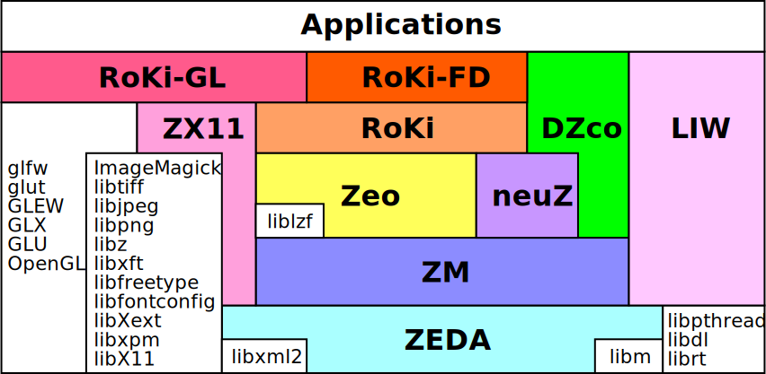

mi-libチュートリアル
====================================================================================================
Copyright (C) Tomomichi Sugihara (Zhidao)

 - 2023.01.17. 作成 Zhidao
 - 2023.01.27. 最終更新 Zhidao

----------------------------------------------------------------------------------------------------

# 前書き

mi-libとは、運動知能研究室（*m*otor *i*ntelligence laboratory）で開発された次のライブラリ群の総称です。

 - **ZEDA** : Elementary Data and Algorithms （基本的なデータ型とアルゴリズム）
 - **ZM** : a handy mathematics library （数値計算・最適化）
 - **neuZ** : neural network library （ニューラルネットワーク）
 - **DZco** : digital control library （デジタル制御）
 - **Zeo** : Z/Geometry and optics computation library （計算幾何学）
 - **RoKi** : Robot Kinetics library （ロボット運動学・力学計算）
 - **RoKi-GL** : Robot Kinetics library: visualization using OpenGL （ロボット可視化）
 - **RoKi-FD** : Robot Kinetics library: Forward Dynamics computation （ロボット順動力学シミュレーション）
 - **ZX11** : a wrapper for interface library to the X Window System （X11と画像処理）
 - **LIW** : Linux Wizard to assist system dependent operations on Linux （Linuxシステムプログラミング）

これらは下図のような依存関係があります（上にあるものが下にあるものを利用します。）。

ロボットの制御やシミュレーション、アプリケーション作成等に幅広く使える機能を集めています。
本チュートリアルを通して、これらのライブラリの使い方に慣れて頂ければ幸いです。

現在、開発は主にUbuntu上で行われています。
LIWを除き、UNIX互換OSならばいずれも使えるものと思います。
実際、Debian、NetBSD、FreeBSD、Solaris、Vx-Worksで使用実績があります。

# 目次

 1. [mi-libをインストールしよう](install.md)

## RoKi

 1. [ロボットモデルを作ろう](roki/tutorial_roki001.md)
 1. [ロボットモデルをプログラムで使おう](roki/tutorial_roki002.md)
 1. [ロボットアームの速度・加速度解析]()
 1. [ロボットアームの逆動力学解析]()
 1. [ロボットアームの逆運動学]()
 1. [順動力学シミュレーション]()
 1. [ロボットアームの到達運動制御シミュレーション]()
 1. [ロボットアームのインピーダンス制御シミュレーション]()
 1. [二脚ロボットの歩行動作設計]()
 1. [二脚ロボットの逆動力学解析]()
