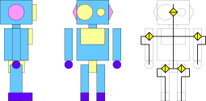
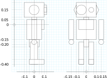
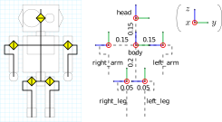
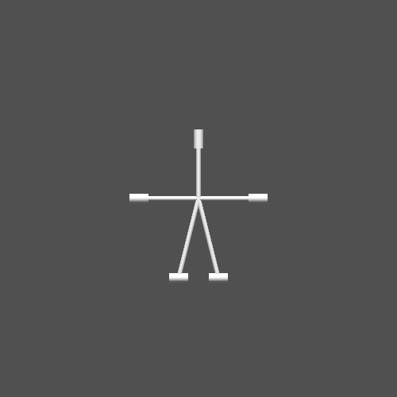
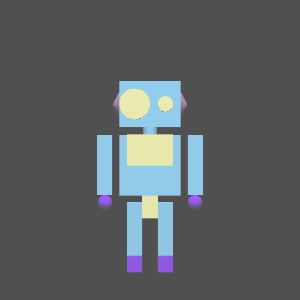
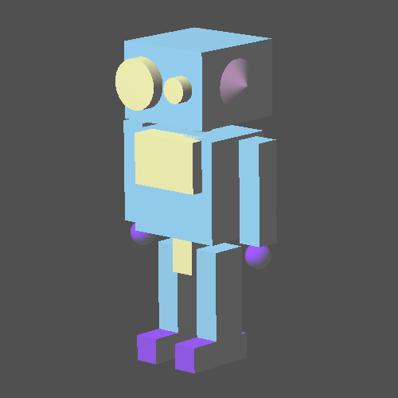
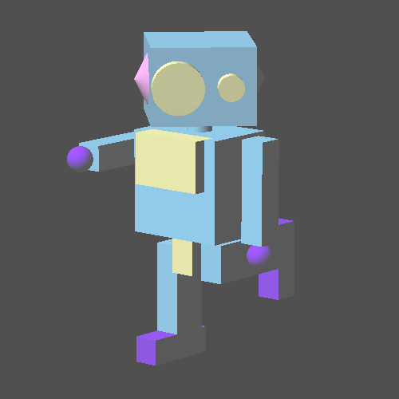

RoKiチュートリアル: ロボットモデルを作ろう
====================================================================================================
Copyright (C) Tomomichi Sugihara (Zhidao)

 - 2023.01.17. 作成 Zhidao
 - 2024.11.02. 最終更新 Zhidao

----------------------------------------------------------------------------------------------------

# スーパーロボット君登場

RoKiで扱えるロボットモデル作りを体験しましょう。
手始めに、下のようなかっこいいロボットのモデルを作ってみることにします。



一番右の図が関節配置を表しています。
シンバルを二つ向かい合わせにしたような黄色い記号は、回転する関節を表しています。
このロボットは、首が鉛直軸まわりに旋回し、両肩と両股関節が前後に振り子のように回転する、計5個の関節を持っていることになります。

# ロボットモデルの寸法と座標系

おおよその寸法を下図のように決めましょう。



次に、関節配置に合わせて、リンク座標系を設定します。

 - それぞれの座標系は$z$軸が関節軸と一致していること
 - その際、$z$軸は関節変位の正方向を向いていること（回転関節ならば右ねじの法則から決まる）
 - 関節による接続と同じ隣接関係で座標系同士がつながっていること

というルールを守っていれば、あとは自由です。
ついでにリンクに名前をつけましょう。
例えば下の右図のように設定できます。



凡例のように、赤が$x$軸、緑が$y$軸、青が$z$軸をそれぞれ意味しています。
首関節は左回りを正、両肩と両股関節は前に振り上げる方向を正としています。

# 骨組みを作る

骨組みだけならここまでの情報だけで作れます。
次のファイル `super_robot.ztk` を作りましょう。

```
[roki::robot]
name: super_robot

[roki::link]
name: body
jointtype: float

[roki::link]
name: head
parent: body
jointtype: revolute
pos: ( 0, 0, 0.15 )

[roki::link]
name: left_arm
parent: body
jointtype: revolute
pos: ( 0, 0.15, 0 )
att:
 1, 0, 0,
 0, 0,-1,
 0, 1, 0,

[roki::link]
name: right_arm
parent: body
jointtype: revolute
pos: ( 0, -0.15, 0 )
att:
 1, 0, 0,
 0, 0,-1,
 0, 1, 0,

[roki::link]
name: left_leg
parent: body
jointtype: revolute
pos: ( 0, 0.05, -0.2 )
att:
 1, 0, 0,
 0, 0,-1,
 0, 1, 0,

[roki::link]
name: right_leg
parent: body
jointtype: revolute
pos: ( 0, -0.05, -0.2 )
att:
 1, 0, 0,
 0, 0,-1,
 0, 1, 0,
```

これをrk_penで描画してみます。
```sh
% rk_pen super_robot.ztk -bone
```

-boneオプションを忘れずつけて下さい。



太めの円筒が関節を表しています。
手先・足先が無いので骨が関節のところでとまってしまっていて、まだロボットっぽく見えませんが、
リンクが正しく接続されていることと、関節の位置関係・接続関係は分かると思います。

少し解説します。
最初の`[roki::robot]`タグは、ロボット全体に属するプロパティを書き入れるフィールドを作ります。
今のところプロパティは、ロボットの名前を表す`name`だけです。

`[roki::link]`タグは、個々のリンクに属するプロパティを書き入れるフィールドを作ります。
`name`はリンクの名前です。一意であれば何でも構いません。
`jointtype`は関節の種類で、後ほど詳しく説明します。
今は`body`リンクだけ`float`、他は`revolute`となっています。
`parent`には、リンクがつながっている根本に近い側のリンク（親リンク）の名前を書きます。
この例では`body`リンクがそれ以外の全てのリンク(`head`, `left_arm`, `right_arm`, `left_leg`, `right_leg`)の親になっています。
`pos`、`att`はそれぞれ親リンク座標系からの並進、姿勢変換を表します。

`head`リンク座標系は`body`リンク座標系に対して$z$軸正方向に0.15ずれただけですから、
```
pos: ( 0, 0, 0.15 )
```
としています。
`left_arm`リンク座標系は、位置は`body`リンク座標系に対して$y$軸方向に0.15ずれていますので
```
pos: ( 0, 0.15, 0 )
```
です。
実は括弧と,（コンマ）は不要ですが、書く側にとっての見やすさのために書いています。
姿勢については次のように考えます。
`left_arm`リンク座標系の$x$軸、$y$軸、$z$軸はそれぞれ`body`リンク座標系の$x$軸、$z$軸、$-y$方向を向いています。
単位ベクトルで表せば、それぞれ$[1~0~0]^{\mathrm{T}}$、$[0~0~1]^{\mathrm{T}}$、$[0~-1~0]^{\mathrm{T}}$で、これらを並べた
```
 1 0  0
 0 0 -1
 0 1  0
```
が姿勢変換行列です。
他のリンクについても同様です。

# 形を作る

最後にロボットの形を作っていきましょう。
色（光学情報）は`[zeo::optic]`タグ、形は`[zeo::shape]`タグでそれぞれフィールドを作り、必要な情報を書き入れます。
色は次の4色に関する情報を追記しましょう。
どこでも構いませんが、特別な事情がなければ`[roki::robot]`タグフィールドの次が良いでしょう。

```
[zeo::optic]
name: cyan
ambient: 0.5, 0.5, 0.5
diffuse: #64c8ff
specular: 0, 0, 0

[zeo::optic]
name: yellow
ambient: 0.5, 0.5, 0.5
diffuse: #ffff96
specular: 0, 0, 0

[zeo::optic]
name: blue
ambient: 0.5, 0.5, 0.5
diffuse: #6400ff
specular: 0, 0, 0

[zeo::optic]
name: pink
ambient: 0.5, 0.5, 0.5
diffuse: #ff96ff
specular: 0, 0, 0
```

`name`は、一意に決まりさえすれば何でも構いません。
`ambient`は環境光（当てるライト）の色、
`diffuse`は物体の拡散光（地）の色、
`specular`は物体の反射光（照り返し）の色です。
指定はいずれも赤・緑・青成分の順で、0〜1の値3つ、あるいは頭に`#`をつけて16進数の値とします（`#xxyyzz`ならば`xx`が赤、`yy`が緑、`zz`が青の成分となります）。
`[zeo::optic]`のプロパティには他に`shininess`（発光色）、`esr`（Phongの反射指数）、`alpha`（透過率）がありますが、通常は未指定で構いません。

形はプリミティブを使えば比較的簡単に作れます。
次を`[zeo::optic]`タグフィールドの次に追記しましょう。

```
[zeo::shape]
name: torso
type: box
optic: cyan
center: ( 0, 0, -0.05 )
width: 0.2
height: 0.2
depth: 0.15

[zeo::shape]
name: chest_plate
type: box
optic: yellow
center: ( 0.075, 0, 0 )
width: 0.15
height: 0.1
depth: 0.05

[zeo::shape]
name: crotch
type: box
optic: yellow
center: ( 0, 0, -0.15 )
width: 0.05
height: 0.15
depth: 0.1

[zeo::shape]
name: neck
type: cylinder
optic: cyan
center: ( 0, 0, 0.05 )
center: ( 0, 0, 0.1 )
radius: 0.025

[zeo::shape]
name: head
type: box
optic: cyan
center: ( 0, 0, 0 )
width: 0.2
height: 0.15
depth: 0.2

[zeo::shape]
name: left_eye
type: cylinder
optic: yellow
center: ( 0.125, 0.05, 0 )
center: ( 0.1, 0.05, 0 )
radius: 0.025

[zeo::shape]
name: right_eye
type: cylinder
optic: yellow
center: ( 0.125, -0.05, 0 )
center: ( 0.1, -0.05, 0 )
radius: 0.05

[zeo::shape]
name: left_ear
type: cone
optic: pink
center: ( 0, 0.1, 0 )
vert: ( 0, 0.125, 0 )
radius: 0.05

[zeo::shape]
name: right_ear
type: cone
optic: pink
center: ( 0, -0.1, 0 )
vert: ( 0, -0.125, 0 )
radius: 0.05

[zeo::shape]
name: arm
type: box
optic: cyan
center: ( 0, -0.05, 0 )
width: 0.2
height: 0.05
depth: 0.05

[zeo::shape]
name: hand
type: sphere
optic: blue
center: ( 0, -0.175, 0 )
radius: 0.025

[zeo::shape]
name: leg
type: box
optic: cyan
center: ( 0, -0.075, 0 )
width: 0.2
height: 0.05
depth: 0.075

[zeo::shape]
name: foot
type: box
optic: blue
center: ( 0.025, -0.175, 0 )
width: 0.05
height: 0.05
depth: 0.15
```

`name`は形状の名前、`type`は形状の種類、`optic`は使用する色の名前です。
`type`には`box`（直方体）、`sphere`（球）、`cylinder`（円柱）、`capsule`（カプセル）、`cone`（円錐）、`ellipsoid`（回転楕円体）、`ellipticcylinder`（楕円柱）、`polyhedron`（多面体）、`nurbs`（NURBS曲面）があります。
他のプロパティは、形状の種類ごとに異なります。
ここで使用している`box`、`sphere`、`cylinder`、`cone`に関して記せば、

`box`
 - `center` : 直方体の中心座標
 - `width` : $y$軸に沿う辺の長さ
 - `height` : $z$軸に沿う辺の長さ
 - `depth` : $x$軸に沿う辺の長さ

`sphere`
 - `center` : 球の中心座標
 - `radius` : 半径

`cylinder`
 - `center` : 底面の中心座標（二つ指定する必要があります）
 - `radius` : 底面の半径

`cone`
 - `center` : 底面の中心座標
 - `vert` : 頂点座標
 - `radius` : 底面の半径

です。

これらの`shape`の情報を各`[roki::link]`タグフィールドに追記すれば完了です。
```
[roki::link]
name: body
jointtype: float
shape: torso, chest_plate, crotch, neck

[roki::link]
name: head
(略)
shape: head, left_eye, right_eye, left_ear, right_ear

[roki::link]
name: left_arm
(略)
shape: arm, hand

[roki::link]
name: right_arm
(略)
shape: arm, hand

[roki::link]
name: left_leg
(略)
shape: leg, foot

[roki::link]
name: right_leg
(略)
shape: leg, foot
```

-boneオプションを外して、rk_penで見てみましょう。



冒頭に描いたかっこいいスーパーロボット君が現れました。
rk_penの描画画面はマウスで並進・回転・ズームできます。



ポーズも作ってみましょう。
ターミナルで5番のコマンド "set joint displacement" を選んで、
リンク1（`head`）の関節角度を45°、
リンク3（`right_arm`）の関節角度を90°、
リンク4（`left_leg`）の関節角度を-90°にそれぞれしてみます。



できましたか？
