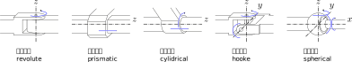
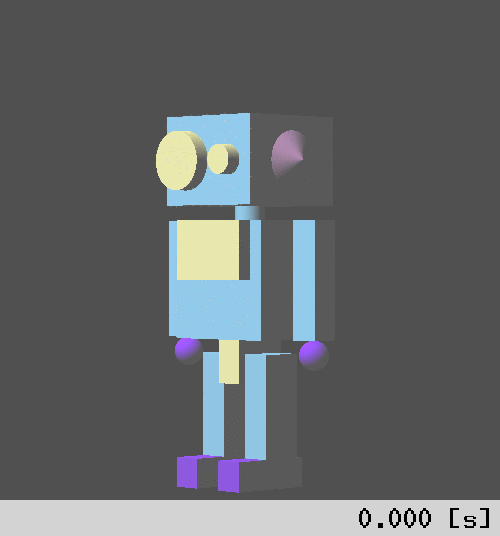

RoKiチュートリアル: ロボットモデルをプログラムで使おう
====================================================================================================
Copyright (C) Tomomichi Sugihara (Zhidao)

 - 2023.01.17. 作成 Zhidao
 - 2023.03.12. 最終更新 Zhidao

----------------------------------------------------------------------------------------------------

# Cプログラムでのロボットモデルファイル読み込み

[前回](tutorial_roki001.md)作成したスーパーロボット君のモデルファイル[super_robot.ztk](super_robot.ztk)を使ったプログラムの書き方を見ていきます。
まずは次のようなCプログラムを作りましょう。
```C
#include <roki/roki.h>

int main(int argc, char *argv[])
{
  rkChain robot;

  rkChainReadZTK( &robot, "super_robot.ztk" );
  rkChainDestroy( &robot );
  return 0;
}
```
`rkChain`はキネマティックチェーンを表す構造体です。
プログラムのファイル名をsuper\_robot\_read.cとして、これをコンパイルするには次のようにします。
```sh
% gcc `roki-config --cflags` super_robot_read.c `roki-config -l`
```
このように、必要なオプションはroki-configを使って展開することができます。
次のようなmakefileを作っておくのも良いでしょう。
```makefile
CC=gcc
CFLAGS= -Wall -O3 `roki-config --cflags`
LINK=`roki-config -l`

%: %.c
	$(CC) $(CFLAGS) -o $@ $< $(LINK)
clean:
	-rm -f *.o *~
```

これを使えば、
```sh
% make super_robot_read
```
とすることで実行ファイルsuper\_robot\_readが出来ます。

# 簡単な順運動学計算

## 関節ごとに変位を与える

上記のプログラムは、super\_robot.ztkファイルを読み込んで`rkChain`構造体インスタンスを作り、すぐにそれを破棄する、ということしかやっていません。
もう少し意味のある計算をやってみましょう。
前回の例ではrk\_penを使って関節を動かしましたが、これをプログラム上でやってみます。
次のプログラムを実行してみて下さい。

```C
#include <roki/roki.h>

int main(int argc, char *argv[])
{
  rkChain robot;
  rkLink *l;
  zVec3D hand_local, hand_world;
  double dis;

  rkChainReadZTK( &robot, "super_robot.ztk" );
  zVec3DCreate( &hand_local, 0, -0.175, 0 ); /* right hand position in the link frame */
  l = rkChainFindLink( &robot, "right_arm" );

  printf( "center of rotation\n" );
  zVec3DPrint( rkLinkWldPos(l) );

  rkLinkPointWldPos( l, &hand_local, &hand_world );
  printf( "before rotation\n" );
  zVec3DPrint( &hand_world );

  dis = zDeg2Rad(90.0);
  rkLinkJointSetDis( l, &dis );
  rkChainUpdateFK( &robot );

  rkLinkPointWldPos( l, &hand_local, &hand_world );
  printf( "after rotation\n" );
  zVec3DPrint( &hand_world );

  rkChainDestroy( &robot );
  return 0;
}
```
処理の意味を一つひとつ説明していきます。
まず、`right_arm`リンク座標系における右手の位置ベクトルを`hand_local`としています。
```C
  zVec3DCreate( &hand_local, 0, -0.175, 0 ); /* right hand position in the link frame */
```
次に、`right_arm`リンクへのポインタを取得しています。
```C
  l = rkChainFindLink( &robot, "right_arm" );
```
`rkLink`はリンク構造体です。
念のため、世界座標系におけるリンク関節中心（回転中心）の座標を表示します。
```C
  printf( "center of rotation\n" );
  zVec3DPrint( rkLinkWldPos(l) );
```
世界座標系における右手の位置を`rkLinkPointWldPos()`で取得して、
結果をベクトル`hand_world`に保存し表示します。
```C
  rkLinkPointWldPos( l, &hand_local, &hand_world );
  printf( "before rotation\n" );
  zVec3DPrint( &hand_world );
```
その後、`rkLinkJointSetDis()`で左肩に適当な関節角度を与え、
`rkChainUpdateFK()`で全リンク座標系を更新します（`FK`は**順運動学**（Forward Kinematics）の略です）。
```C
  dis = zDeg2Rad(90.0);
  rkLinkJointSetDis( l, &dis );
  rkChainUpdateFK( &robot );
```
なお、度をラジアンに変更するのに`zDeg2Rad()`を用いました。
先程と同じく、`rkLinkPointWldPos()`により`hand_local`を`hand_world`に変換します。
```C
  rkLinkPointWldPos( l, &hand_local, &hand_world );
  printf( "after rotation\n" );
  zVec3DPrint( &hand_world );
```
最後に`rkChain`構造体を破棄して終わりです。
```C
  rkChainDestroy( &robot );
```
実行すれば、次のような出力が得られるはずです。
```
center of rotation
( 0, -0.15, 0)
before rotation
( 0, -0.15, -0.175)
after rotation
( 0.175, -0.15, -1.071565949e-17)
```
前回決めた座標系によれば、初期姿勢で
世界座標系における`right_arm`の関節中心の位置は( 0, -0.15, 0 )、
右手先位置（球の中心）は( 0, -0.15, -0.175 )ですから、
関節を90°上に回転させれば右手先位置は( 0.175, -0.15, 0 )になるはずです。
上記の結果と（ラジアン変換の影響で微小な誤差が乗っていますが）合っています。

なお、上記プログラム中で出てきた3次元ベクトル構造体`zVec3D`はZeoで、`zDeg2Rad()`はZMで、それぞれ定義されています。

全く同じ動作をするプログラムは、次のようにも書けます。
```C
#include <roki/roki.h>

int main(int argc, char *argv[])
{
  rkChain robot;
  int id;
  zVec3D hand_local, hand_world;
  double dis;

  rkChainReadZTK( &robot, "super_robot.ztk" );
  zVec3DCreate( &hand_local, 0, -0.175, 0 );
  id = rkChainFindLinkID( &robot, "right_arm" );

  printf( "center of rotation\n" );
  zVec3DPrint( rkChainLinkWldPos( &robot, id ) );

  rkChainLinkPointWldPos( &robot, id, &hand_local, &hand_world );
  printf( "before rotation\n" );
  zVec3DPrint( &hand_world );

  dis = zDeg2Rad(90.0);
  rkChainLinkJointSetDis( &robot, id, &dis );
  rkChainUpdateFK( &robot );

  rkChainLinkPointWldPos( &robot, id, &hand_local, &hand_world );
  printf( "after rotation\n" );
  zVec3DPrint( &hand_world );

  rkChainDestroy( &robot );
  return 0;
}
```
先ほどと違い、`rkChainFindLinkID()`で得たリンクのIDと
`rkChainLinkWldPos()`、`rkChainLinkPointWldPos()`を使って
ロボットリンク上の点の座標を求めています。

## 関節の種類とリンク構造

上に**順運動学**という言葉が出てきました。
これは、ある関節変位を与えたときのキネマティックチェーンの身体部位の位置や姿勢を求める計算のことです。
正しく順運動学を行うには、関節についての理解が必須です。

RoKiで扱える関節には、

 - 固定関節（fixed joint）
 - 回転関節（revolute joint）
 - 直動関節（prismatic joint）
 - 円筒関節（cylindrical joint）
 - 自在継手（universal joint）
 - 球面関節（spherical joint）
 - 浮遊関節（float joint）

の7種類があります。
固定関節は完全に拘束されて変位しない関節、浮遊関節は逆に完全に非拘束で自由に並進・回転できる関節です。
それ以外の関節は下図のように模式されます。



各リンクは、一つの関節で一つの親リンクに接続します（このため関節プロパティはリンクタグフィールドに属します）。
親リンクはparentフィールド、関節の種類はjointtypeフィールドにそれぞれ書くのでした。
逆に一つの親リンクは複数のリンクを子に持てますので、
リンク系全体は根となる一つのリンク（ルートリンク）から樹木のように枝を伸ばす構造となります。
super\_robot.ztkでは、bodyがルートリンク、
残りのhead、left\_arm、right\_arm、left\_leg、right\_legが全てbodyの子リンクとなっています。

ルートリンクも関節を持ちます。
bodyリンクのjointtypeはfloat（浮遊関節）となっています。
これは、ルートリンクを**世界座標系**に接続します。

各関節の変位は、可動方向に対応する複数の値によって表されます。
回転関節ならば軸（$z$軸）回りの回転角度、自在継手ならば1つ目の軸（$z$軸）回り回転角度と2つ目の軸（$y$軸）回り回転角度、といった具合です。
球面関節の変位は**角軸ベクトル**で表します。
これは、
姿勢の変化をある軸まわりの一回の回転で表したときの、軸方向に平行で、長さが回転角度に一致するベクトルです。
なお、角度の単位は全てラジアンです。
浮遊関節の変位は6つの値で表され、最初の3成分が並進ベクトル、残りの3成分が角軸ベクトルにそれぞれ対応します。

## 全関節の変位を一度に与える

リンク系全体の姿勢は、各リンクの関節変位を便宜上ベクトルのように並べたもので表すことができます。
たとえばsuper\_robotの場合はbodyの関節変位が6個、残りリンクの関節変位がそれぞれ1個の値で表されますので、
これらを成分に持つ11次元のベクトル$\boldsymbol{q}=(q_{1}, q_{2}, q_{3}, q_{4}, q_{5}, q_{6}, q_{7}, q_{8}, q_{9}, q_{10}, q_{11})$がロボットの全身姿勢を一意に表します。
$(q_{1},q_{2},q_{3})$が慣性座標系から見たbody原点の座標、
$(q_{4},q_{5},q_{6})$が同じくbody座標系の姿勢、
$q_{7}$、$q_{8}$、$q_{9}$、$q_{10}$、$q_{11}$がそれぞれhead、left\_arm、right\_arm、left\_leg、right\_legの回転角度です。
この$\boldsymbol{q}$のことを、**関節変位ベクトル**とか**一般化座標**とか**コンフィギュレーション**とか呼びます。
厳密にはこれはベクトルではありません。その証拠にこの$\boldsymbol{q}$は加減算できません。
ですが、ロボット工学はそのあたり寛容で、数値が複数並んでいればあまり注意せずベクトルと呼んでしまうことがよくあります。

関節変位ベクトルを用いてロボット姿勢を変えるプログラムの例を示します。
```C
#include <roki/roki.h>

#define LINK_ID_HEAD 1
#define LINK_ID_RARM 3
#define LINK_ID_LLEG 4

void output(rkChain *robot)
{
  zVec3D hand_local, hand_world, hand_d, foot_local, foot_world, foot_d;

  zVec3DCreate( &hand_local, 0, -0.175, 0 );
  zVec3DCreate( &foot_local, 0, -0.175, 0 );

  printf( "head attitude (before rotation)\n" );
  zMat3DPrint( rkChainLinkWldAtt( robot, LINK_ID_HEAD ) );

  printf( "right hand position from joint center\n" );
  rkChainLinkPointWldPos( robot, LINK_ID_RARM, &hand_local, &hand_world );
  zVec3DPrint( zVec3DSub( &hand_world, rkChainLinkWldPos( robot, LINK_ID_RARM ), &hand_d ) );

  printf( "leg foot position from joint center\n" );
  rkChainLinkPointWldPos( robot, LINK_ID_LLEG, &foot_local, &foot_world );
  zVec3DPrint( zVec3DSub( &foot_world, rkChainLinkWldPos( robot, LINK_ID_LLEG ), &foot_d ) );
}

int main(int argc, char *argv[])
{
  rkChain robot;
  int j_head, j_righthand, j_leftfoot;
  zVec dis;

  rkChainReadZTK( &robot, "super_robot.ztk" );
  dis = zVecAlloc( rkChainJointSize( &robot ) );

  j_head      = rkChainFindLinkJointIDOffset( &robot, "head" );
  j_righthand = rkChainFindLinkJointIDOffset( &robot, "right_arm" );
  j_leftfoot  = rkChainFindLinkJointIDOffset( &robot, "left_leg" );

  printf( "(before rotation)\n" );
  output( &robot );
  zVecSetElem( dis, j_head,      zDeg2Rad(45) );
  zVecSetElem( dis, j_righthand, zDeg2Rad(90) );
  zVecSetElem( dis, j_leftfoot,  zDeg2Rad(-90) );
  rkChainFK( &robot, dis );
  printf( "after rotation\n" );
  output( &robot );

  zVecFree( dis );
  rkChainDestroy( &robot );
  return 0;
}
```
`main()`関数から追っていきましょう。
先の例と同じようにsuper\_robot\.ztkを読み込んで`rkChain`インスタンスを作成した後に、
```C
  dis = zVecAlloc( rkChainJointSize( &robot ) );
```
として、ロボットの関節変位ベクトルを用意します。
`rkChainJointSize()`はロボットの関節変位ベクトルのサイズを自動計算する関数です。
上で説明した通り、super\_robotならば11になるはずです。
なお、`zVec`はZMで定義されています。`zVecAlloc()`はZMのライブラリ関数です。

次に
```C
  j_head      = rkChainFindLinkJointIDOffset( &robot, "head" );
  j_righthand = rkChainFindLinkJointIDOffset( &robot, "right_arm" );
  j_leftfoot  = rkChainFindLinkJointIDOffset( &robot, "left_leg" );
```
として、関節変位ベクトルの中でhead、right\_arm、left\_legの変位に対応する値が保持される成分の
開始ID（関節IDオフセット）を取得しています。

関節を動かす前の姿勢を
```C
  printf( "(before rotation)\n" );
  output( &robot );
```
のように出力しておきます。
`output()`は頭の姿勢と右手先と左足先の位置を表示する関数で、コード前半部に定義しました。
```C
#define LINK_ID_HEAD 1
#define LINK_ID_RARM 3
#define LINK_ID_LLEG 4

void output(rkChain *robot)
{
  zVec3D hand_local, hand_world, hand_d, foot_local, foot_world, foot_d;

  zVec3DCreate( &hand_local, 0, -0.175, 0 );
  zVec3DCreate( &foot_local, 0, -0.175, 0 );

  printf( "head attitude (before rotation)\n" );
  zMat3DPrint( rkChainLinkWldAtt( robot, LINK_ID_HEAD ) );

  printf( "right hand position from joint center\n" );
  rkChainLinkPointWldPos( robot, LINK_ID_RARM, &hand_local, &hand_world );
  zVec3DPrint( zVec3DSub( &hand_world, rkChainLinkWldPos( robot, LINK_ID_RARM ), &hand_d ) );

  printf( "leg foot position from joint center\n" );
  rkChainLinkPointWldPos( robot, LINK_ID_LLEG, &foot_local, &foot_world );
  zVec3DPrint( zVec3DSub( &foot_world, rkChainLinkWldPos( robot, LINK_ID_LLEG ), &foot_d ) );
}
```
リンクIDは、真面目にやるならば先ほどのように`rkChainFindLinkID()`で取得すべきですが、
`rkChain`のリンク配列にはモデルファイルに現れた[link]が順番に入りますので、
この例のようにリンク数が少なければ、予め分かっている値を直接書いてしまうのも良いでしょう。

`rkChainLinkWldAtt()`は世界座標系から見たリンク座標系の姿勢（3×3行列）を返します。
`zVec3DSub()`で、手先/足先位置ベクトルからリンク座標系原点（関節中心）のベクトルを引いて、
回転による位置変化を読み取りやすくしています。
なお、3次元ベクトルの四則演算は`zVec3DAdd()`、`zVec3DSub()`、`zVec3DMul()`、`zVec3DDiv()`でそれぞれ行えます。
乗算・除算はどちらもスカラによるものです。
3次元ベクトル同士の内積は`zVec3DInnerProd()`、外積は`zVec3DOuterProd()`で求められます。
これらについてはZeoのチュートリアルで詳しく説明します。

先ほど取得した関節IDオフセットを使って、関節変位ベクトル`dis`の成分に値をセットします。
```C
  zVecSetElem( dis, j_head,      zDeg2Rad(45) );
  zVecSetElem( dis, j_righthand, zDeg2Rad(90) );
  zVecSetElem( dis, j_leftfoot,  zDeg2Rad(-90) );
```
これを適用して運動学を解きます。
前の例では、関節変位を変えてから`rkChainUpdateFK()`を呼んでいましたが、
この例で使っているのは`rkChainFK()`という関数です。
```C
  rkChainFK( &robot, dis );
```
そして
```C
  printf( "after rotation\n" );
  output( &robot );
```
として姿勢を出力します。

最後に関節変位ベクトルとキネマティックチェーンを破棄して終了です。
```
  zVecFree( dis );
  rkChainDestroy( &robot );
```
`zVecFree()`もZMのライブラリ関数です。

プログラムを実行してみて下さい。次のような出力が得られたでしょうか。
```
(before rotation)
head attitude (before rotation)
{
 1, 0, 0
 0, 1, 0
 0, 0, 1
}
right hand position from joint center
( 0, 0, -0.175)
leg foot position from joint center
( 0, 0, -0.175)
after rotation
head attitude (before rotation)
{
 0.7071067812, -0.7071067812, 0
 0.7071067812, 0.7071067812, 0
 0, 0, 1
}
right hand position from joint center
( 0.175, 0, -1.071565949e-17)
leg foot position from joint center
( -0.175, 0, 0)
```

## 動きの可視化

数字だけからロボットの姿勢をイメージするのは、慣れるまではなかなか大変です。
ロボットがどのように動くのかを可視化するために、rk\_animというツールの使い方を紹介しましょう。
先ほどのプログラムを少し改造して、次のようにします。
```C
#include <roki/roki.h>

#define N 100

int main(int argc, char *argv[])
{
  rkChain robot;
  int j_head, j_righthand, j_leftfoot;
  zVec dis;
  double angle;
  int i;

  rkChainReadZTK( &robot, "super_robot.ztk" );
  dis = zVecAlloc( rkChainJointSize( &robot ) );

  j_head      = rkChainFindLinkJointIDOffset( &robot, "head" );
  j_righthand = rkChainFindLinkJointIDOffset( &robot, "right_arm" );
  j_leftfoot  = rkChainFindLinkJointIDOffset( &robot, "left_leg" );

  for( i=0; i<=N; i++ ){
    angle = zDeg2Rad(90) * i / N;
    zVecSetElem( dis, j_head,  0.5*angle );
    zVecSetElem( dis, j_righthand, angle );
    zVecSetElem( dis, j_leftfoot, -angle );
    printf( "%g ", 1.0 / N );
    zVecPrint( dis );
  }
  zVecFree( dis );
  rkChainDestroy( &robot );
  return 0;
}
```
`rkChain`インスタンスは関節変位ベクトルと関節IDオフセットを得るためだけに利用しています。
運動学計算は行っていません。
これを"super\_robot\_anim.c"という名前で保存し、コンパイルして出力を次のようにリダイレクトします。
```sh
% ./super_robot_anim > test.zvs
```
拡張子.zvsで終わるファイルは、姿勢シーケンスを保存するものです。
コードを見て頂ければ分かる通り、フォーマットは
```
Δt n ( q_1, ..., qn )
...
```
となっています。
これを可視化するには次のようにします。
```sh
% rk_anim super_robot.ztk test.zvs -x 3 -y 3 -pan 45
```


スーパーロボット君がこちらを向いてくれたでしょうか？

-x、-yオプションはカメラの$x$、$y$座標、
-panオプションはカメラのパン角度（反時計回り）をそれぞれ指定するものです。
他にもいろいろなオプションがあり、
```sh
% rk_anim -help
```
で確認できます。
