RoKiチュートリアル: ロボットアームの速度・加速度解析
====================================================================================================
Copyright (C) Tomomichi Sugihara (Zhidao)

 - 2023.02.13. 作成 Zhidao
 - 2024.08.03. 最終更新 Zhidao

----------------------------------------------------------------------------------------------------

# PUMAモデル

スーパーロボット君はかっこいいのですが、
もう少し真面目にロボットアームの運動解析を練習するために、PUMAのモデルを使います。
`example/model/`の下にある`puma.ztk`がそれです。

PUMA（Programmable Universal Machine for Assembly）は、
1975年に当時米スタンフォード大学の学生だったシェインマンが作ったロボットです。
歴史的に重要な存在なのですが、
蘊蓄はさておきrk\_penで姿を見てみましょう。
```sh
% rk_pen example/model/puma.ztk -x 2 -y -- -1.9 -z 2.1 -pan -- -45 -tilt -- -35
```
次のような絵が現れるはずです。

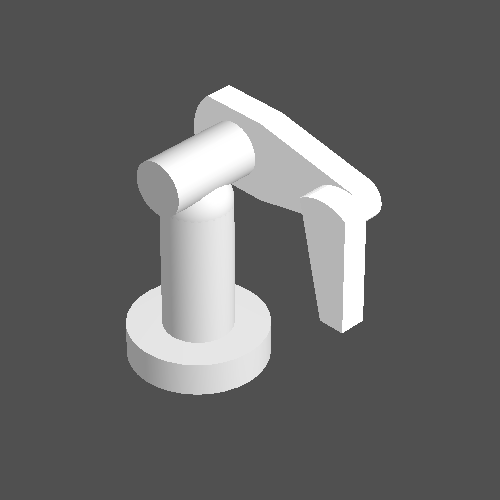

rk\_penの機能を使って、もう少しこのロボットのことを調べてみましょう。
```
Select(0-15)\>
```
とプロンプトが出ているので、0. show link listを選びます。
```
Select(0-15)>0
[ 0] base
[ 1] link1
[ 2] link2
[ 3] link3
[ 4] link4
[ 5] link5
[ 6] link6
```
のような出力が得られたでしょうか。
これより、ロボットが7個のリンクから成っていること、およびそれぞれのリンクの名前とIDの対応が分かります。
次に、1. show structureを選びましょう。
```
Select(0-15)>1
Chain : PUMA
|-[0] base (fixed)
  |-[1] link1 (revolute:0)
    |-[2] link2 (revolute:1)
      |-[3] link3 (revolute:2)
        |-[4] link4 (revolute:3)
          |-[5] link5 (revolute:4)
            |-[6] link6 (revolute:5)
```
これは次のように読みます。

 - `rkChain`インスタンスの名前は `PUMA` です。
 - リンク0の名前は `base` で、固定関節で世界座標系に連結されています。
 - リンク1の名前は `link1` で、回転関節で `base` に連結されています。関節ベクトルが与えられたとき、その要素0がこの関節に対応する先頭成分です。
 - リンク2の名前は `link2` で、回転関節で `link1` に連結されています。関節ベクトルが与えられたとき、その要素1がこの関節に対応する先頭成分です。
 - ...

[ロボットモデルを作ろう](tutorial_roki001.md)ですでに試した通り、-boneオプションをつけてrk\_penを起ち上げると、ロボットの関節配置を見ることが出来ます。
```sh
% rk_pen example/model/puma.ztk -x 2 -y -- -1.9 -z 2.1 -pan -- -45 -tilt -- -35 -bone
```

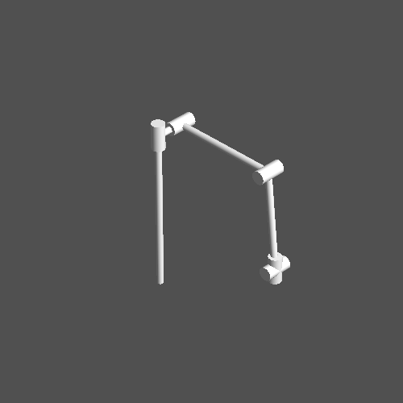

link 1関節は水平旋回、link 2関節は肩、link 3関節は肘、link 4～6関節は手首にそれぞれ相当することが、なんとなく見て取れるかと思います。

rk\_penを使って、関節を動かしてみましょう。
5. set joint displacementsを選んで
```
Select(0-15)>5
enter link ID> 2
change joint displacement of link link2
enter value 0/1 [-180-180]> -45
```
と入力すれば、次のような絵が得られます。

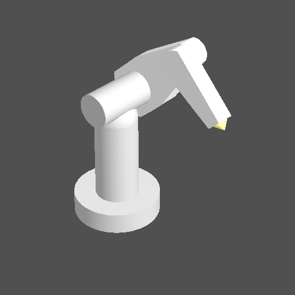

link IDやvalueをいろいろ変えて試してみて下さい。


# プログラムで動きを作る

Cプログラムの中でPUMAを動かしてみましょう。
簡単のためlink 1～3関節だけ使うことにして、次のようなプログラムを書いてみます。

```C
#include <roki/rk_chain.h>

#define T 3.0

#define STEP 100

void set_joint_angle(zVec q, double t)
{
  double phase;

  phase = zPIx2 * t / T;
  zVecSetElem( q, 0, zDeg2Rad(45) * sin(  phase) );
  zVecSetElem( q, 1, zDeg2Rad(30) * sin(2*phase) );
  zVecSetElem( q, 2, zDeg2Rad(60) * sin(2*phase) - zPI_2 );
}

int main(int argc, char *argv[])
{
  rkChain robot;
  zVec q;
  FILE *fp;
  int i;

  if( !rkChainReadZTK( &robot, "puma" ) ||
      !( q = zVecAlloc( rkChainJointSize(&robot) ) ) ||
      !( fp = fopen( "test.zvs", "w" ) ) )
    return EXIT_FAILURE;

  for( i=0; i<STEP; i++ ){
    set_joint_angle( q, T*(double)i/STEP );
    rkChainFK( &robot, q );
    fprintf( fp, "%g ", T / STEP );
    zVecFPrint( fp, q );
  }
  fclose( fp );
  zVecFree( q );
  rkChainDestroy( &robot );
  return EXIT_SUCCESS;
}
```

`set_joint_angle()`という関数の中で、
```math
\displaylines{
q_1 &= \pi/4 \sin 2\pi t/T \\
q_2 &= \pi/6 \sin 4\pi t/T \\
q_3 &= \pi/3 \sin 4\pi t/T - \pi/2 \\
}
```
のように時刻tの関数としてそれぞれの関節角度を決めています。
ただし$T=3.0$sです。
なお、`zPIx2`は2π、`zPI_2`はπ/2をそれぞれ与えるマクロです。

これをコンパイル・実行すると`test.zvs`というファイルが出来ます。
rk\_animを使って動きを見てみましょう。
```
% rk_anim puma.ztk test.zvs -z 0.2 -x 4
```

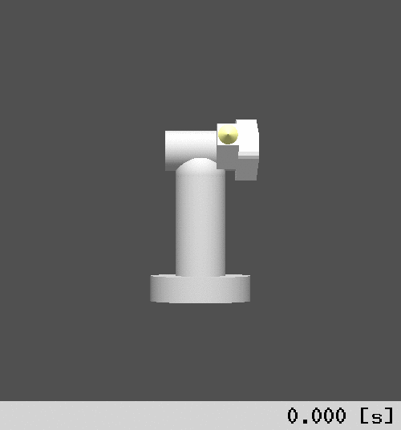

このとき例えば手先が描いている軌跡は、[前回](tutorial_roki002.md)同様に`rkChainLinkWldPos()`関数を使えば得られます。
`main()`関数の`for`ループの中を、次のように修正して下さい。

```C
  for( i=0; i<STEP; i++ ){
    set_joint_angle( q, T*(double)i/STEP );
    rkChainFK( &robot, q );
    fprintf( fp, "%g ", T / STEP );
    zVecFPrint( fp, q );
    zVec3DDataPrint( rkChainLinkWldPos(&robot,6) );
    zEndl();
  }
```

これをコンパイル・実行すると、標準出力に値の列が出力されますので、適当なファイルにリダイレクトして適当な3次元プロットツールで表示してみましょう。
例えばgnuplotで表示すると、下のような図が得られます。

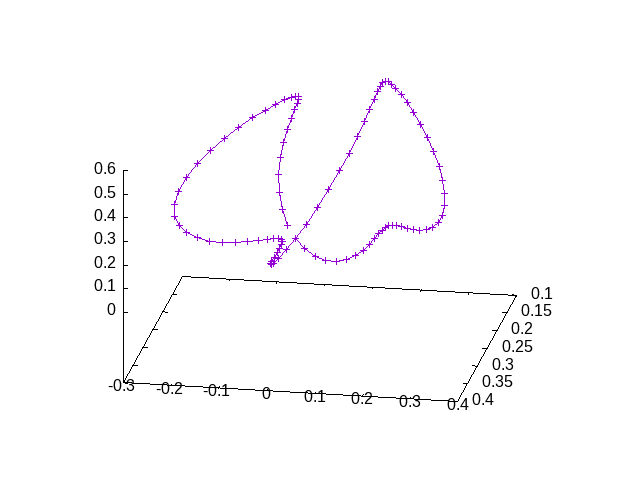

# 手先の速度・加速度を求める

上記の動作は割と派手に腕を振り回すものですので、手先はそれなりに大きな速度・加速度を持ちそうに思えます。
実際のところどれくらいの速度・加速度で動いているのか？調べてみましょう。

関節角度は時刻の関数として与えたので、これらを時間に関して微分すれば、関節角速度・関節角加速度が分かります。
```math
\displaylines{
dq_1/dt &= 2\pi/T・\pi/4 \cos 2\pi t/T \\
dq_2/dt &= 4\pi/T・\pi/6 \cos 4\pi t/T \\
dq_3/dt &= 4\pi/T・\pi/3 \cos 4\pi t/T \\
d^2q_1/dt^2 &=-(2\pi/T)^2・\pi/4 \sin 2\pi t/T \\
d^2q_2/dt^2 &=-(4\pi/T)^2・\pi/6 \sin 4\pi t/T \\
d^2q_3/dt^2 &=-(4\pi/T)^2・\pi/3 \sin 4\pi t/T \\
}
```
これに基づいて、次のように関節角速度ベクトル・関節角加速度ベクトルも作るよう`set_joint_angle()`関数を修正しましょう。
```C
void set_joint_angle(zVec q, zVec dq, zVec ddq, double t)
{
  double phase, omega;

  omega = zPIx2 / T;
  phase = omega * t;
  zVecSetElem( q, 0, zDeg2Rad(45) * sin(  phase) );
  zVecSetElem( q, 1, zDeg2Rad(30) * sin(2*phase) );
  zVecSetElem( q, 2, zDeg2Rad(60) * sin(2*phase) - zPI_2 );
  zVecSetElem( dq, 0,   omega * zDeg2Rad(45) * cos(  phase) );
  zVecSetElem( dq, 1, 2*omega * zDeg2Rad(30) * cos(2*phase) );
  zVecSetElem( dq, 2, 2*omega * zDeg2Rad(60) * cos(2*phase) );
  zVecSetElem( ddq, 0,-  zSqr(omega) * zDeg2Rad(45) * sin(  phase) );
  zVecSetElem( ddq, 1,-4*zSqr(omega) * zDeg2Rad(30) * sin(2*phase) );
  zVecSetElem( ddq, 2,-4*zSqr(omega) * zDeg2Rad(60) * sin(2*phase) );
}
```
`main()`関数も次のように変えます。
```C
int main(int argc, char *argv[])
{
  rkChain robot;
  zVec q, dq, ddq;
  zVec3D vel, acc;
  FILE *fp;
  int i;

  if( !rkChainReadZTK( &robot, "puma" ) ||
      !( q = zVecAlloc( rkChainJointSize(&robot) ) ) ||
      !( dq = zVecAlloc( rkChainJointSize(&robot) ) ) ||
      !( ddq = zVecAlloc( rkChainJointSize(&robot) ) ) ||
      !( fp = fopen( "test.zvs", "w" ) ) )
    return EXIT_FAILURE;

  for( i=0; i<STEP; i++ ){
    set_joint_angle( q, dq, ddq, T*(double)i/STEP );
    rkChainSetJointDisAll( &robot, q );
    rkChainSetJointVelAll( &robot, dq );
    rkChainSetJointAccAll( &robot, ddq );
    rkChainUpdateFK( &robot );
    rkChainUpdateRate0G( &robot );
    zMulMat3DVec3D( rkChainLinkWldAtt(&robot,6), rkChainLinkLinVel(&robot,6), &vel );
    zMulMat3DVec3D( rkChainLinkWldAtt(&robot,6), rkChainLinkLinAcc(&robot,6), &acc );
    /* ZVS */
    fprintf( fp, "%g ", T / STEP );
    zVecFPrint( fp, q );
    /* hand position & velocity & acceleration */
    zVec3DDataPrint( rkChainLinkWldPos(&robot,6) );
    zVec3DDataPrint( &vel );
    zVec3DDataPrint( &acc );
    zEndl();
  }
  fclose( fp );
  zVecFreeAO( 3, q, dq, ddq );
  rkChainDestroy( &robot );
  return EXIT_SUCCESS;
}
```
`rkChainSetJointDisAll()`、`rkChainSetJointVelAll()`、`rkChainSetJointAccAll()`関数で関節変位ベクトル、関節速度ベクトル、関節加速度ベクトルをそれぞれセットし、`rkChainUpdateFK()`で全リンク座標系を、`rkChainUpdateRate0G()`で全リンクの速度・加速度をそれぞれ更新しています。

先程のプログラムでは、
```C
    rkChainFK( &robot, q );
```
としていましたが、これは
```C
    rkChainSetJointDisAll( &robot, q );
    rkChainUpdateFK( &robot );
```
と等価です。

`rkChainUpdateRate0G()`とよく似た`rkChainUpdateRate()`という関数もあります。後者は、重力加速度も加算した全リンクの加速度を求めます。したがって、重力加速度を除外したい場合には前者を用いて下さい。

関節速度ベクトル・関節加速度ベクトルを同時にセットする`rkChainSetJointRateAll()`という関数もあります。これを使う場合には、上記プログラムで
```C
    rkChainSetJointVelAll( &robot, dq );
    rkChainSetJointAccAll( &robot, ddq );
```
となっているところを
```C
    rkChainSetJointRateAll( &robot, dq, ddq );
```
と置き換えれば良いです。

リンクの速度・加速度は`rkChainLinkLinVel()`、`rkChainLinkLinAcc()`でそれぞれ得られるのですが、計算上の都合で、これらは方向がリンク座標系から見たものになっています。
世界座標系から見た方向に直すには、`zMulMat3DVec3D()`関数を用いてリンク座標系の姿勢行列`rkChainLinkWldAtt()`を掛けてやる必要があります。
なお、`zMulMat3DVec3D()`はZeoのライブラリ関数です。

最後の`zVecFreeAO()`は、複数の`zVec`インスタンスをいっぺんに破棄する、ZMのライブラリ関数です。

上記プログラムをコンパイル・実行すると、毎ステップのlink6位置x, y, z成分、速度x, y, z成分、加速度x, y, z成分が標準出力に出力されます。
先程と同様に、適当なファイルにリダイレクトして適当な3次元プロットツールで表示してみましょう。
gnuplotで成分ごとに見てみると、次のようなグラフが得られます。

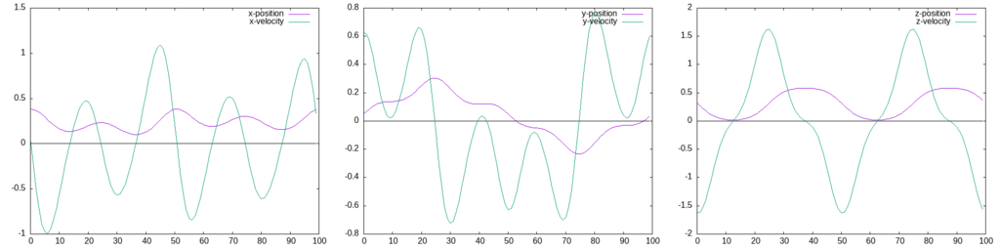
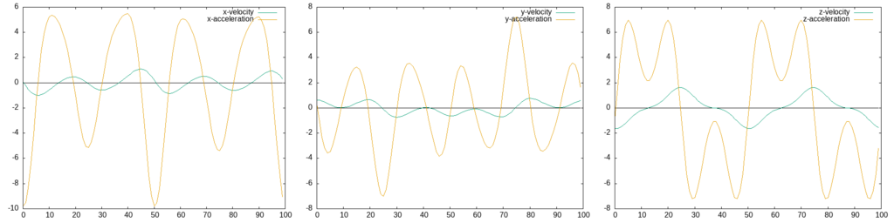

緑線が紫線の微分、黄色線が緑線の微分であることは、なんとなく見て取れます。
あくまでも参考程度ですが、`main()`関数を次のように変えてみましょう。
```C
int main(int argc, char *argv[])
{
  rkChain robot;
  zVec q, dq, ddq;
  zVec3D vel, acc;
  zVec3D pos_prev, vel_prev, vel_approx, acc_approx;
  FILE *fp;
  int i;

  if( !rkChainReadZTK( &robot, "puma" ) ||
      !( q = zVecAlloc( rkChainJointSize(&robot) ) ) ||
      !( dq = zVecAlloc( rkChainJointSize(&robot) ) ) ||
      !( ddq = zVecAlloc( rkChainJointSize(&robot) ) ) ||
      !( fp = fopen( "test.zvs", "w" ) ) )
    return EXIT_FAILURE;

  zVec3DCopy( rkChainLinkWldPos(&robot,6), &pos_prev );
  zMulMat3DVec3D( rkChainLinkWldAtt(&robot,6), rkChainLinkLinVel(&robot,6), &vel_prev );
  for( i=0; i<STEP; i++ ){
    set_joint_angle( q, dq, ddq, T*(double)i/STEP );
    rkChainSetJointDisAll( &robot, q );
    rkChainSetJointVelAll( &robot, dq );
    rkChainSetJointAccAll( &robot, ddq );
    rkChainUpdateFK( &robot );
    rkChainUpdateRate0G( &robot );
    zMulMat3DVec3D( rkChainLinkWldAtt(&robot,6), rkChainLinkLinVel(&robot,6), &vel );
    zMulMat3DVec3D( rkChainLinkWldAtt(&robot,6), rkChainLinkLinAcc(&robot,6), &acc );
    zVec3DSub( rkChainLinkWldPos(&robot,6), &pos_prev, &vel_approx );
    zVec3DDivDRC( &vel_approx, T / STEP );
    zVec3DSub( &vel, &vel_prev, &acc_approx );
    zVec3DDivDRC( &acc_approx, T / STEP );
    zVec3DCopy( rkChainLinkWldPos(&robot,6), &pos_prev );
    zVec3DCopy( &vel, &vel_prev );
    /* ZVS */
    fprintf( fp, "%g ", T / STEP );
    zVecFPrint( fp, q );
    /* hand position & velocity & acceleration */
    zVec3DDataPrint( rkChainLinkWldPos(&robot,6) );
    zVec3DDataPrint( &vel );
    zVec3DDataPrint( &vel_approx );
    zVec3DDataPrint( &acc );
    zVec3DDataPrint( &acc_approx );
    zEndl();
  }
  fclose( fp );
  zVecFreeAO( 3, q, dq, ddq );
  rkChainDestroy( &robot );
  return EXIT_SUCCESS;
}
```
前ステップの位置・速度をそれぞれ`pos_prev`、`vel_prev`に保存し、新たに計算された位置・速度との差をとった後に`T/STEP`で割って、速度・加速度の近似値`vel_approx`および`acc_approx`を求めています。
`zVec3DCopy`、`zVec3DSub()`、`zVec3DDivDRC()`はいずれもZeoのライブラリ関数です。

これらの近似値と一緒にプロットすると、次のようなグラフが得られます。

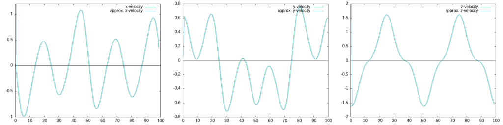
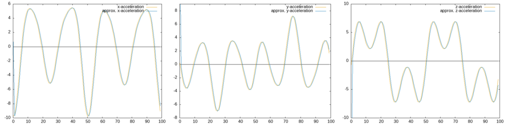

それほど大きく外れていないことが分かります。

# 簡易版速度・加速度解析

上記の例では、関節角度がたまたま時刻tの関数として与えられ、それを手計算で微分することで関節速度・加速度が直接得られました。
一般的には、そのようなことが出来ない場合も多いでしょう。そのような場合にはどうすれば良いでしょうか。

たとえば関節角度の近似曲線をスプライン補間などで作り（その機能はZMに用意されています）、それを微分するのは良い方法です。
が、おおよその値さえ分かれば良いという場合は、`rkChainFKCNT()`という関数が使えます。
```C
  rkChainFKCNT( &robot, q, dt );
```
ただし、`dt`は離散時間幅です。
これは、「時間`dt`をかけて関節変位が現在地から`q`に変化した」と考え、差分近似によって関節速度・加速度を求めた上で全リンクの速度・加速度を求めるものです。
これを使った次のようなプログラムを実行してみましょう。
```C
#include <roki/rk_chain.h>

#define T 3.0

#define STEP 100

void set_joint_angle(zVec q, double t)
{
  double phase;

  phase = zPIx2 * t / T;
  zVecSetElem( q, 0, zDeg2Rad(45) * sin(  phase) );
  zVecSetElem( q, 1, zDeg2Rad(30) * sin(2*phase) );
  zVecSetElem( q, 2, zDeg2Rad(60) * sin(2*phase) - zPI_2 );
}

int main(int argc, char *argv[])
{
  rkChain robot;
  zVec q;
  zVec3D vel, acc;
  FILE *fp;
  double dt;
  int i;

  if( !rkChainReadZTK( &robot, "puma" ) ||
      !( q = zVecAlloc( rkChainJointSize(&robot) ) ) ||
      !( fp = fopen( "test.zvs", "w" ) ) )
    return EXIT_FAILURE;

  dt = T / STEP;
  for( i=0; i<STEP; i++ ){
    set_joint_angle( q, T*(double)i/STEP );
    rkChainFKCNT( &robot, q, dt );
    zMulMat3DVec3D( rkChainLinkWldAtt(&robot,6), rkChainLinkLinVel(&robot,6), &vel );
    zMulMat3DVec3D( rkChainLinkWldAtt(&robot,6), rkChainLinkLinAcc(&robot,6), &acc );
    zVec3DSubDRC( &acc, RK_GRAVITY3D );
    /* hand position & velocity & acceleration */
    zVec3DDataPrint( rkChainLinkWldPos(&robot,6) );
    zVec3DDataPrint( &vel );
    zVec3DDataPrint( &acc );
    zEndl();
  }
  fclose( fp );
  zVecFree( q );
  rkChainDestroy( &robot );
  return EXIT_SUCCESS;
}
```
`rkChainFKCNT()`で計算される加速度`acc`は重力加速度を含むので、
```C
    zVec3DSubDRC( &acc, RK_GRAVITY3D );
```
として重力加速度ベクトルを引いてやります。
`zVec3DSubDRC()`はZeoのライブラリ関数です。

このプログラムも毎ステップのlink6位置x, y, z成分、速度x, y, z成分、加速度x, y, z成分を標準出力に出力するので、gnuplotで成分ごとに見てみると、次のようなグラフが得られます。

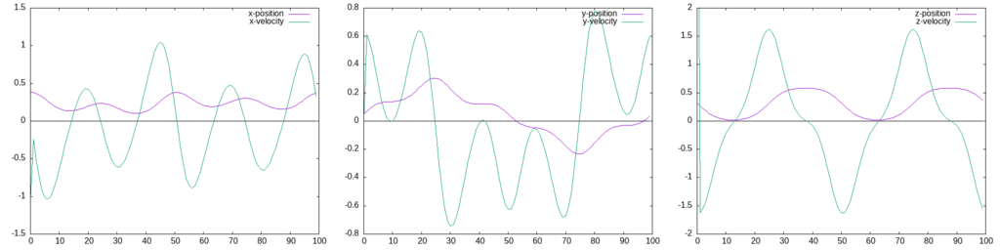
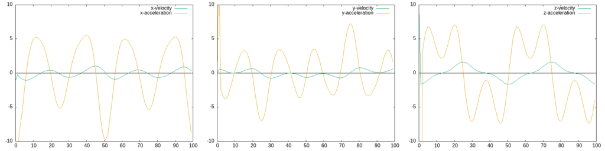

動作開始時（t=0付近）ではどうしても値がおかしくなりますが、全体としては先程の図と似た結果が得られていることが分かります。
