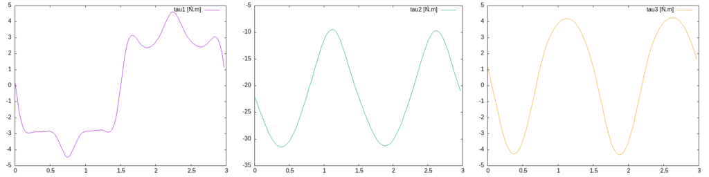

RoKiチュートリアル: ロボットアームの逆動力学
====================================================================================================
Copyright (C) Tomomichi Sugihara (Zhidao)

 - 2024.08.03. 作成 Zhidao
 - 2024.12.15. 最終更新 Zhidao

----------------------------------------------------------------------------------------------------

# ロボットの質量特性

[前回](tutorial_roki003.md)PUMAにさせた動作はそれなりに激しいものでしたので、実際にロボットにさせようとしたとき、関節にはどれくらいの負荷がかかるのかは当然気になります。
このような、ある運動を実現するために関節が発揮しなければならないトルクを逆算する計算を、**逆動力学**と呼びます。

物理的な因果関係から言えば、関節に搭載されたモータの端子間に電圧をかけると、回路インピーダンスと逆起電力に応じて巻線を流れる電流が決まり、その電流が受けるローレンツ力が駆動トルクとなり、それが身体の慣性に反比例して関節角加速度を産み出し、積分されて角速度、さらには角度と変化していく…というのが、ロボットの運動が生じる流れです。
この流れに沿った計算が順動力学、この流れを逆にたどる計算が逆動力学である、と考えれば理解が容易になると思います。
ただし、モータや回路のダイナミクスまで考慮することは稀で、通常は運動（主に加速度）と関節トルクの関係すなわち運動方程式に基づく計算に留まります。

さて、運動と力とを結びつけるためには、慣性の情報、具体的にはロボットを構成する各リンクの質量（慣性0次モーメント）・重心位置（慣性1次モーメント）・慣性テンソル（慣性2次モーメント）が必要です。
これらは全て、リンク座標系におけるリンクの質量分布から決まるもので、まとめて**質量特性**と呼ばれます。

`puma.ztk`の`[roki::link]`フィールドを見てみましょう。
```
[roki::link]
name : base
jointtype : fixed
shape: base
shape: post

[roki::link]
name : link1
jointtype : revolute
max : 180
min :-180
DH: { 0, 0, 0.3, 0 }
inertia: {
 0, 0, 0,
 0, 0, 0,
 0, 0, 0.35 }
parent : base
shape: shoulderroot

[roki::link]
name : link2
jointtype : revolute
max : 180
min :-180
DH: { 0, -90, 0.05, 0 }
mass: 17.4
inertia: {
 0.13, 0, 0,
 0, 0.524, 0,
 0, 0, 0.539 }
COM: { 0.068, 0.006, -0.016 }
parent : link1
shape: shoulder
shape: upperarm

...
```
最初の`base`リンクは固定された土台なので良いとして、`link1`では$`zz`$成分のみ0.35でそれ以外0の`inertia`が与えられています。`link2`ではさらに、`mass`、対角成分が全て非零な`inertia`、そして`COM`が与えられていることが分かります。

※それ以外に`DH`というプロパティも目につくかと思います。これは **（拡張）DHパラメータ** と呼ばれるもので、別の回で説明します。

`link1`の`inertia`はなぜ$`zz`$成分しか与えられていないのかについて、別に他の成分も厳密に与えられていても構わないのですが、`link1`の（回転）関節は水平面内を旋回するだけなので、これ以外の質量特性は運動方程式に現れません。
このため、計算に関係ない成分は全て0としている、とういうわけです。
一方、`link2`は3次元的に動くので、全ての成分が計算に関係してきます。
対称性の高い部品で形状を近似しているため、慣性テンソルが対角行列となっています。
ちなみにこれらの値は、1986年に米スタンフォード大のOussama Khatibらのグループが頑張って同定したものです。

Brian Armstrong, Oussama Khatib and Joel Burdick, "The Explicit Dynamic Model and Inertial Parameters of the PUMA 560 Arm," in Proceedings of the 1986 IEEE International Conference on Robotics and Automation, pp.510-518, 1986.

なお、`inertia`は必ず正定値対称行列でなければなりません。


# 逆動力学

質量特性が与えられれば、運動（変位・速度・加速度）と力（トルク）とを結び付けることができます。
いくつかのアルゴリズムが知られていますが、RoKiではLuh, Walker, Paulが提案したNewton-Euler法を採用しています。

J. Y. S. Luh, M. W. Walker, and R. P. C. Paul, "On-Line Computational Scheme for Mechanical Manipulators," Transactions of the ASME, Journal of Dynamic Systems, Measurement, and Control, Vol. 102, pp. 69-76, 1980.

中身については上記文献を読んで頂くとして、次のようなコードを作ってみましょう。

```C
#include <roki/rk_chain.h>

#define T 3.0

#define STEP 100

void set_joint_angle(zVec q, zVec dq, zVec ddq, double t)
{
  double phase, omega;

  omega = zPIx2 / T;
  phase = omega * t;
  zVecSetElem( q, 0, zDeg2Rad(45) * sin(  phase) );
  zVecSetElem( q, 1, zDeg2Rad(30) * sin(2*phase) );
  zVecSetElem( q, 2, zDeg2Rad(60) * sin(2*phase) - zPI_2 );
  zVecSetElem( dq, 0,   omega * zDeg2Rad(45) * cos(  phase) );
  zVecSetElem( dq, 1, 2*omega * zDeg2Rad(30) * cos(2*phase) );
  zVecSetElem( dq, 2, 2*omega * zDeg2Rad(60) * cos(2*phase) );
  zVecSetElem( ddq, 0,-  zSqr(omega) * zDeg2Rad(45) * sin(  phase) );
  zVecSetElem( ddq, 1,-4*zSqr(omega) * zDeg2Rad(30) * sin(2*phase) );
  zVecSetElem( ddq, 2,-4*zSqr(omega) * zDeg2Rad(60) * sin(2*phase) );
}

int main(int argc, char *argv[])
{
  rkChain robot;
  zVec q, dq, ddq, trq;
  int i;
  double t;

  if( !rkChainReadZTK( &robot, "puma" ) ||
      !( q = zVecAlloc( rkChainJointSize(&robot) ) ) ||
      !( dq = zVecAlloc( rkChainJointSize(&robot) ) ) ||
      !( ddq = zVecAlloc( rkChainJointSize(&robot) ) ) ||
      !( trq = zVecAlloc( rkChainJointSize(&robot) ) ) )
    return EXIT_FAILURE;

  for( i=0; i<STEP; i++ ){
    set_joint_angle( q, dq, ddq, ( t = T*(double)i/STEP ) );
    rkChainID( &robot, q, dq, ddq, trq );
    printf( "%g %g %g %g %g %g %g %g %g %g\n", t, zVecElem(q,0), zVecElem(q,1), zVecElem(q,2), zVecElem(dq,0), zVecElem(dq,1), zVecElem(dq,2), zVecElem(trq,0), zVecElem(trq,1), zVecElem(trq,2) );
  }
  zVecFreeAtOnce( 4, q, dq, ddq, trq );
  rkChainDestroy( &robot );
  return EXIT_SUCCESS;
}
```

`set_joint_angle()`関数と`main()`関数の前半は、[前回](tutorial_roki003.md)示したものと同じです。
これによって作成された関節変位ベクトル`q`、関節速度ベクトル`dq`、関節加速度ベクトル`ddq`を`rkChainID()`に与えて、逆動力学を解いています。
出力`trq`は全関節のトルク値をまとめたベクトルで、**関節トルクベクトル**とか**一般化座標に対応する一般化力ベクトル**などと呼ばれます。
これは、次のように書いても同じ結果が得られます。
```C
  rkChainSetJointDisAll( &robot, q );
  rkChainUpdateFK( &robot );
  rkChainSetJointRateAll( &robot, dq, ddq );
  rkChainUpdateID( &robot );
  rkChainGetJointTrqAll( &robot, trq );
```
`rkChainGetJointTrqAll()`は、全ての関節トルクを関節トルクベクトルにまとめて取り出す関数です。
特定のリンク、例えばリンク1の関節トルクだけを取り出したい場合は、次のように出来ます。
```C
  double torque;
  rkChainLinkJointGetTrq( &chain, 1, &torque );
```
リンク1の関節は回転関節なので、変位は一つの値しか持ちません。
円筒関節や球面関節のような多自由度関節の場合には、その自由度と一致する数の成分を持つ`double`型配列へのポインタを第3引数に与えれば良いです。

上記プログラムをコンパイル・実行すると、`link1`、`link2`、`link3`の関節角度、同3リンクの関節速度、同3リンクの関節トルクがこの順番で標準出力に出力されます。
これをグラフにプロットすると次のようになります。




上が関節角度、下が関節トルクです（横軸の単位はsです）。
大雑把な見方ですが、

 - 関節角度は正弦波状に変化するので、関節加速度はそれと逆位相になり、関節トルクもおおよそそれに比例する（はず）
 - `link1`関節（旋回軸）が1往復する間に`link2`と`link3`の関節は2往復し、それと連動して旋回軸から見た重心までの距離も近づいて離れるを2回繰り返す。したがって`link1`関節トルクは1/3Hzの波と2/3Hzの波を合成した波形になる

くらいの推定は出来、傾向がこれと整合する結果が得られていることも分かります。

また、速度-トルク曲線は次のようになります（絶対値をとっています）。


これをモータカタログにある速度-トルク曲線と比較すれば、どのくらい余裕があるかが分かるでしょう。


# 逆動力学演算の中身を少しだけ

上で紹介した`rkChainID()`と`rkChainUpdateID()`は、実は関数ではなくマクロです。
関数プロトタイプは`rk_chain.h`の中で次のように宣言されています。
```C
void rkChainUpdateID_G(rkChain *chain, const zVec6D *g);
#define rkChainUpdateID(chain)     rkChainUpdateID_G( chain, RK_GRAVITY6D )
#define rkChainUpdateID0G(chain)   rkChainUpdateID_G( chain, ZVEC6DZERO )

zVec rkChainID_G(rkChain *chain, const zVec dis, const zVec vel, const zVec acc, const zVec6D *g, zVec trq);
#define rkChainID(chain,dis,vel,acc,trq)   rkChainID_G( chain, dis, vel, acc, RK_GRAVITY6D, trq )
#define rkChainID0G(chain,dis,vel,acc,trq) rkChainID_G( chain, dis, vel, acc, ZVEC6DZERO,   trq )
```
つまり実体は`rkChainUpdateID_G`、`rkChainID_G()`という関数です。
これらがとる引数`g`は「場の加速度」を意味します。
`rkChainUpdateID()`と`rkChainID()`は`RK_GRAVITY6D`を指定しているので重力場における逆動力学、`rkChainUpdateID0G()`と`rkChainID0G()`は`ZVEC6DZERO`を指定しているので無重力場における逆動力学を、それぞれ計算しているというわけです。

`rkChainUpdateID_G()`は次のように定義されています。
```
void rkChainUpdateID_G(rkChain *chain, const zVec6D *g)
{
  rkChainUpdateRateG( chain, g );
  rkChainUpdateWrench( chain );
  rkChainUpdateCOMVel( chain );
  rkChainUpdateCOMAcc( chain );
}
```
`rkChainUpdateRateG()`は、[前回](tutorial_roki003.md)紹介した`rkChainUpdateRate()`と`rkChainUpdateRate0G()`の実体で、場の加速度`g`を含む全リンクの速度・加速度を計算します。
`rkChainUpdateWrench()`は、全リンクの速度・加速度が更新されている前提で、全リンクの関節にかかるレンチ（力・トルクの組）を更新する関数です。
その中で、関節トルクもレンチから求めています。
`rkChainUpdateCOMVel()`と`rkChainUpdateCOMAcc()`はおまけで、リンク全体の重心速度・加速度を更新します。

なお、[前回](tutorial_roki003.md)紹介した`rkChainFKCNT()`も、内部的には逆動力学を解いています。
次のプログラムをコンパイル・実行してみましょう。
```C
#include <roki/rk_chain.h>

#define T 3.0

#define STEP 100

void set_joint_angle(zVec q, double t)
{
  double phase;

  phase = zPIx2 * t / T;
  zVecSetElem( q, 0, zDeg2Rad(45) * sin(  phase) );
  zVecSetElem( q, 1, zDeg2Rad(30) * sin(2*phase) );
  zVecSetElem( q, 2, zDeg2Rad(60) * sin(2*phase) - zPI_2 );
}

int main(int argc, char *argv[])
{
  rkChain robot;
  zVec q, trq;
  double t, dt;
  int i;

  if( !rkChainReadZTK( &robot, "puma" ) ||
      !( q = zVecAlloc( rkChainJointSize(&robot) ) ) ||
      !( trq = zVecAlloc( rkChainJointSize(&robot) ) ) )
    return EXIT_FAILURE;

  dt = T / STEP;
  for( i=0; i<STEP; i++ ){
    set_joint_angle( q, ( t = T*(double)i/STEP ) );
    rkChainFKCNT( &robot, q, dt );
    rkChainGetJointTrqAll( &robot, trq );
    printf( "%g %g %g %g %g %g %g\n", t, zVecElem(q,0), zVecElem(q,1), zVecElem(q,2), zVecElem(trq,0), zVecElem(trq,1), zVecElem(trq,2) );
  }
  zVecFreeAtOnce( 2, q, trq );
  rkChainDestroy( &robot );
  return EXIT_SUCCESS;
}
```
この結果の関節トルクのグラフは次のようになります。


動作開始時（t=0付近）の値は信頼性が低いですが、おおむね先程の図と似た結果が得られています。
