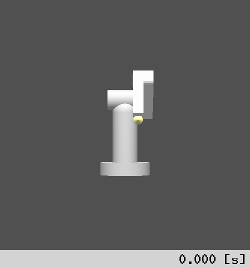

RoKiチュートリアル: ロボットアームの逆運動学
====================================================================================================
Copyright (C) Tomomichi Sugihara (Zhidao)

 - 2024.08.07. 作成 Zhidao
 - 2024.11.07. 最終更新 Zhidao

----------------------------------------------------------------------------------------------------

# 逆運動学とは

関節を動かして手先（エフェクタ）の運動を作り、世界に働きかける、というのがロボット運動の機序です。
ロボットに作業をさせたい、つまり何か意味のある働きかけをさせたいときは、最初にエフェクタをどう振舞わせるべきかという目標運動を考え、そこから逆に関節の目標運動を求める、という上記の機序と逆方向の問題を解くことになります。
これは**逆運動学**と呼ばれます。

数学的には、関節変位ベクトルを$`\boldsymbol{q}`$、エフェクタの変位を$`\boldsymbol{p}`$とおくと、$`\boldsymbol{p}`$は$`\boldsymbol{q}`$の写像となります。
```math
\boldsymbol{p}=\boldsymbol{f}(\boldsymbol{q})
```
これは[順運動学](tutorial_roki002.md)にほかなりません。
逆運動学とは$`\boldsymbol{f}`$の逆写像を計算することにほかなりませんが、ここには次の難しさがあります。

 1. 解がそもそも存在するとは限らない
 1. 解が無数に存在することがある
 1. 解が有限個であったとしても、一意に存在するとは限らない
 1. 解が解析的に求まらない

これらのことを順番に説明しましょう。

**1. 解がそもそも存在するとは限らない**

全関節をそれぞれの可動範囲の中で任意に動かしたときの関節変位ベクトル$`\boldsymbol{q}`$の集合を、$`\mathcal{Q}`$とおきましょう。
このとき、$`\mathcal{Q}`$に対応してエフェクタがとり得る変位の集合$`\mathcal{P}`$を次のように定義できます。
```math
\mathcal{P}=\left\{
\boldsymbol{p}\left|
\boldsymbol{p}=\boldsymbol{f}(\boldsymbol{q}), \forall\boldsymbol{q}\in\mathcal{Q}
\right.
\right\}
```
$`\mathcal{P}`$を**作業空間**と呼びます。

目標とするエフェクタ変位$`{}^{d}\boldsymbol{p}`$が作業空間$`\mathcal{P}`$に含まれていない場合、典型的にはロボットの手先が届かないほど離れた場所に目標が設定された場合は、それを実現する関節変位は存在しません。

**2. 解が無数に存在することがある**

一般的に、$`\boldsymbol{p}`$の次元と$`\boldsymbol{q}`$の次元は等しいとは限りません。
前者よりも後者の方が大きい場合、$`{}^{d}\boldsymbol{p}`$が$`\mathcal{P}`$に含まれているならば、それを実現する$`\boldsymbol{q}`$は一般的には無数に存在します。
このような状況は「**冗長**である」と言います。

**3. 解が有限個であったとしても、一意に存在するとは限らない**

多くの産業用ロボットは、目標とするエフェクタの動作範囲が作業空間に収まるように配置されます。
エフェクタの変位は3次元の並進と3次元の回転の組で表せるので、それらを合わせた6次元と等しくなるように、関節の数も通常は6個とされます。
このように作業空間の問題と冗長性の問題を回避したとしても、エフェクタ変位を同一にする関節変位は一般的に複数存在します。
これは、変位から角度を逆算する際には象限の異なる複数の可能性が生じるためです。

**4. 解が解析的に求まらない**

解析的に、すなわち有限解の四則演算と逆三角関数の組み合わせによって解を求められるのは、一部の特殊な機構のみであり、一般的には逆運動学の解析的な解は存在しない、ということが理論的に分かっています。

RoKiでは、一般性の高い逆運動学の解法としてLevenberg-Marquardt法による数値解法を実装しています。
これは、直接解を求める替わりに、次の最小二乗問題を反復解法で解くものです。
```math
\boldmath{q}=\mathop{\mathrm{arg~min}}_{\boldsymbol{q}}\left\{\frac{1}{2}\boldsymbol{e}^{\mathrm{T}}(\boldmath{q})\boldsymbol{W}_{\mahrm{E}}\boldsymbol{e}(\boldmath{q})\right\}
```
ただし、$`\boldsymbol{e}(\boldmath{q})`$はエフェクタ変位の目標からの残差、$`\boldsymbol{W}_{\mahrm{E}}`$は$`\boldsymbol{e}(\boldmath{q})`$の各成分にかけられる重みです。
このようにすることで、厳密に$`\boldsymbol{e}(\boldmath{q})=\boldsymbol{0}`$とする解が存在しない場合は、エフェクタ変位の目標からの残差を最小化する姿勢をもって解の代わりにします。

なお、毎回の反復計算では次の最小化問題を解いています。
```math
\varDelta\boldsymbol{q}=\mathop{\mathrm{arg~min}}_{\varDelta\boldsymbol{q}}
\left\{
\frac{1}{2}\|\boldsymbol{J}\varDelta\boldsymbol{q}-\boldsymbol{e}(\boldsymbol{q})\|_{\boldsymbol{W}_{\mathrm{E}}}^{2}+
\frac{1}{2}\varDelta\boldsymbol{q}^{\mathrm{T}}\boldsymbol{W}_{\mathrm{N}}\varDelta\boldsymbol{q}
\right\}
```
ただし、$`\varDelta\boldsymbol{q}`$は毎回の反復での関節変位ベクトルの修正量、$`\boldsymbol{J}`$は$`\boldsymbol{e}(\boldmath{q})`$の勾配$`\partial\boldsymbol{e}(\boldmath{q})/\partial\boldsymbol{q}`$、$`\boldsymbol{W}_{\mathrm{N}}`$は関節変位ベクトル修正量の各成分への重みです。
第二項の働きにより、複数（冗長な場合は無数に）存在する解のうち、現在の関節変位から最も小さい動きで到達できる解を求めることになります。

中身については次の論文

Tomomichi Sugihara, Solvability-Unconcerned Inverse Kinematics by the Levenberg-Marquardt Method, IEEE Transaction on Robotics, Vol.27, Issue.5, pp.984-991, 2011.

を読んで頂くとして、ここではその使い方を説明します。


# 逆運動学を解くサンプルプログラム

PUMAモデルの逆運動学を解く、次のサンプルプログラムを作ってみましょう。
```C
#include <roki/rk_chain.h>

int main(int argc, char *argv[])
{
  rkChain chain;
  zVec dis;
  zFrame3D goal;
  rkIKCell *cell[2];
  rkIKAttr attr;
  zVec6D error;

  if( !rkChainReadZTK( &chain, "puma.ztk" ) ||
      !( dis = zVecAlloc( rkChainJointSize( &chain ) ) ) ) return EXIT_FAILURE;

  rkChainRegisterIKJointAll( &chain, 0.001 );

  rkIKAttrSetLinkID( &attr, &chain, "link6" );
  cell[0] = rkChainRegisterIKCellWldPos( &chain, NULL, 0, &attr, RK_IK_ATTR_MASK_ID );
  cell[1] = rkChainRegisterIKCellWldAtt( &chain, NULL, 0, &attr, RK_IK_ATTR_MASK_ID );

  zFrame3DCopy( rkChainLinkWldFrame( &chain, attr.id ), &goal );
  zFrame3DPos(&goal)->c.x += 0.05;
  zFrame3DPos(&goal)->c.z += 0.1;
  zMat3DRotPitchDRC( zFrame3DAtt(&goal), -zDeg2Rad(90) );

  rkIKCellSetRefVec( cell[0], zFrame3DPos(&goal) );
  rkIKCellSetRefAtt( cell[1], zFrame3DAtt(&goal) );
  rkChainIK( &chain, dis, zTOL, 0 );

  printf( "goal frame\n" );
  zFrame3DPrint( &goal );
  printf( "final frame\n" );
  zFrame3DPrint( rkChainLinkWldFrame(&chain,attr.id) );
  printf( "error\n" );
  zVec6DPrint( zFrame3DError( &goal, rkChainLinkWldFrame(&chain,attr.id), &error ) );
  zVecFree( dis );
  rkChainDestroy( &chain );
  return EXIT_SUCCESS;
}
```

中身を説明していきます。

次の2行はこれまでのサンプルプログラムと同様で、`puma.ztk`を読み込んで`rkChain`インスタンスを`chain`を作り、その関節変位ベクトルを確保しています。
```C
  if( !rkChainReadZTK( &chain, "puma.ztk" ) ||
      !( dis = zVecAlloc( rkChainJointSize( &chain ) ) ) ) return EXIT_FAILURE;
```
次の1行は、PUMAの全関節を逆運動学の求解対象とするという意味です。
```C
  rkChainRegisterIKJointAll( &chain, 0.001 );
```
二つ目の引数は、毎回の反復計算における$`\boldsymbol{W}_{\mathrm{N}}`$を$`\boldsymbol{W}_{\mathrm{N}}=w_{\mathrm{N}}\boldsymbol{1}`$としたときの$`w_{\mathrm{N}}`$に相当します。
関節ごとに異なる重みを設定したい、例えば`link1`の関節の重みを0.01としたい場合は、次のようにします。
```C
  rkChainRegisterIKJoint( &chain, "link1", 0.01 );
```
重みの小さい関節ほど積極的に動かされることになります。
なお、この関数を使って後から重みを変更することも出来ます。

冗長でない場合はこの値は意味を持たないのでは？と感じるかも知れませんが、計算を安定化させる重要な役割を持つので、微小な値を設定するのが良いです。
なお、この値は解の精度には影響しません。

次の行
```C
  rkIKAttrSetLinkID( &attr, &chain, "link6" );
```
では、エフェクタリンク`link6`のIDをIKアトリビュート`rkIKAttr`インスタンス`attr`にセットしています。
同じ処理は次のようにも書けます。
```C
  attr.id = rkChainFindLinkID( &chain, "link6" );
```

逆運動学ソルバの中では、目標値を与えるエフェクタ変位は`rkIKCell`というクラス（**IKセル**）で管理しています。
続く
```C
  cell[0] = rkChainRegisterIKCellWldPos( &chain, NULL, 0, &attr, RK_IK_ATTR_MASK_ID );
```
は、世界座標系におけるエフェクタ原点位置を、
```C
  cell[1] = rkChainRegisterIKCellWldAtt( &chain, NULL, 0, &attr, RK_IK_ATTR_MASK_ID );
```
は、世界座標系におけるエフェクタ姿勢を、それぞれIKセルに指定する関数です。
いずれも第2引数はセルの名前（後からセルを参照したい場合に必要。不要な場合は`NULL`として構いません）、第3引数はセルの優先度（後ほど説明します）、第4引数は設定するIKアトリビュートのポインタ、第5引数は設定するIKアトリビュートのうち有効なフィールドを示すマスクで、返り値は、内部で新規に作成したセルのポインタです。
他のIKセル登録関数、IKアトリビュート、マスクの詳細は後ほど説明します。
上の例の場合は、IKアトリビュートで指定したのは`id`フィールドだけなので、対応するマスクを`RK_IK_ATTR_MASK_ID`としています。

これで、逆運動学を解く下準備が整いました。

続く4行
```C
  zFrame3DCopy( rkChainLinkWldFrame( &chain, attr.id ), &goal );
  zFrame3DPos(&goal)->c.x += 0.05;
  zFrame3DPos(&goal)->c.z += 0.1;
  zMat3DRotPitchDRC( zFrame3DAtt(&goal), -zDeg2Rad(90) );
```
では、エフェクタリンクの現在の座標系を`goal`にコピーし、
$`x`$座標を0.05、$`z`$座標を0.1、それぞれ増やしています。
また、姿勢を$`y`$軸まわりに-90度回転させています。
これらを
```C
  rkIKCellSetRefVec( cell[0], zFrame3DPos(&goal) );
  rkIKCellSetRefAtt( cell[1], zFrame3DAtt(&goal) );
```
としてそれぞれのIKセルにセットしてから、
```C
  rkChainIK( &chain, dis, zTOL, 0 );
```
として逆運動学を解きます。
第3引数は反復計算の打ち切り誤差、第4引数は最大反復回数（0とした場合はZMで定義されている`Z_MAX_ITER_NUM`が採用されます）です。
計算結果は第2引数`dis`に保存されますが、このとき`chain`もその姿勢をとっています。

結果は
```C
  printf( "goal frame\n" );
  zFrame3DPrint( &goal );
  printf( "final frame\n" );
  zFrame3DPrint( rkChainLinkWldFrame(&chain,attr.id) );
  printf( "error\n" );
  zVec6DPrint( zFrame3DError( &goal, rkChainLinkWldFrame(&chain,attr.id), &error ) );
```
で標準出力に出力します。
正常に動作すれば、次のように表示されるはずです。
```
goal frame
{
 6.123233996e-17, 1.224646799e-16, 1, 0.27
 0, -1, 1.224646799e-16, 0.05
 1, -7.498798913e-33, -6.123233996e-17, 0.22
}
final frame
{
 2.775557562e-16, 2.139817532e-16, 1, 0.27
 -5.6958324e-16, -1, 2.139817532e-16, 0.05
 1, -5.6958324e-16, -2.775557562e-16, 0.22
}
error
( -4.773959006e-15, -6.869504965e-16, 2.220446049e-16)
( 6.161138388e-16, 0, 0)
```
打ち切り誤差があるので綺麗な数にはなっていませんが、微小な成分を0と読み替えれば、実質的に
```
goal frame
{
 0,  0, 1, 0.27
 0, -1, 0, 0.05
 1,  0, 0, 0.22
}
final frame
{
 0,  0, 1, 0.27
 0, -1, 0, 0.05
 1,  0, 0, 0.22
}
error
( 0, 0, 0)
( 0, 0, 0)
```
となっていることが分かると思います。
残りの
```C
  zVecFree( dis );
  rkChainDestroy( &chain );
```
でメモリ解放して終了です。

これではロボットがどんな姿勢になっているか分からない、というご不満はごもっともなので、結果を出力する部分を次のように変えてみましょう。
```C
  int i;

  printf( "[roki::chain::init]\n" );
  for( i=0; i<rkChainLinkNum(&chain); i++ ){
    if( rkChainLinkJointDOF(&chain,i) == 0 ) continue;
    printf( "joint: %s ", rkChainLinkName(&chain,i) );
    rkJointDisFPrintZTK( stdout, rkChainLinkJoint(&chain,i) );
  }
```
実行すると標準出力に何やら表示されますので、これを`ik_result.ztk`というファイルにリダイレクトして
```sh
% rk_pen puma.ztk -x 1.5 -y -- -4 -z 0.2 -pan -- -70 -init ik_result.ztk
```
とすれば、次のような表示が得られるでしょう。


最後の `-init ik_result.ztk` を無くしたときの表示と見比べれば、手先が目標位置・姿勢に一致していることがおおよそお分かりになると思います。

もう少し分かりやすい例として、手先で8の字を書かせてみましょう。
次のプログラムをコンパイル・実行してみて下さい。
```C
#include <roki/rk_chain.h>

#define R  0.1

#define T  3.0
#define DT 0.01

int main(int argc, char *argv[])
{
  rkChain chain;
  zVec dis;
  zVec3D goal_origin, goal_rel;
  zFrame3D goal;
  rkIKCell *cell[2];
  rkIKAttr attr;
  double theta;
  int i, step;

  if( !rkChainReadZTK( &chain, "puma.ztk" ) ||
      !( dis = zVecAlloc( rkChainJointSize( &chain ) ) ) ) return EXIT_FAILURE;

  attr.id = rkChainFindLinkID( &chain, "link6" );
  cell[0] = rkChainRegisterIKCellWldPos( &chain, NULL, 0, &attr, RK_IK_ATTR_MASK_ID );
  cell[1] = rkChainRegisterIKCellWldAtt( &chain, NULL, 0, &attr, RK_IK_ATTR_MASK_ID );

  rkChainRegisterIKJointAll( &chain, 0.001 );

  zVec3DCopy( rkChainLinkWldPos( &chain, attr.id ), &goal_origin );
  goal_origin.c.x += 0.05;
  goal_origin.c.z += 0.1;
  zMat3DRotPitch( rkChainLinkWldAtt( &chain, attr.id ), -zDeg2Rad(90), zFrame3DAtt(&goal) );
  rkIKCellSetRefAtt( cell[1], zFrame3DAtt(&goal) );

  step = T / DT;
  for( i=0; i<=2*step; i++ ){
    theta = zPIx2 * i / step;
    zVec3DCreate( &goal_rel, 0, R*sin(theta), R*sin(2*theta) );
    zVec3DAdd( &goal_origin, &goal_rel, zFrame3DPos(&goal) );
    rkIKCellSetRefVec( cell[0], zFrame3DPos(&goal) );
    rkChainIK( &chain, dis, zTOL, 0 );
    printf( "%g ", DT );
    zVecPrint( dis );
  }
  zVecFree( dis );
  rkChainDestroy( &chain );
  return EXIT_SUCCESS;
}
```
エフェクタ姿勢は動作中ずっと変わらないので、`rkIKCellSetRefAtt()`は`for`ループに入る前に一度だけ呼んでいます。
エフェクタ位置の目標値のみ`rkIKCellSetRefVec()`で更新しては`rkChainIK()`で逆運動学を解く、というのを繰り返しています。
標準出力に.zvs形式で関節変位ベクトルの列が出力されるので、これをeight.zvsといファイルにリダイレクトして
```sh
% rk_anim puma.ztk eight.zvs -z 0.2
```
を実行すると、次のようなアニメーションが見られます（実際はもっとゆっくりな動きです。GIFアニメーションのコマ数を落とした都合で速回しになってしまってします）。



# IKセルの登録とIKアトリビュートについて

エフェクタ変位の目標を指定する関数には、次の5種類があります。

 - `rkChainRegisterIKCellWldPos()` … リンク座標系内のある点の世界座標系における位置
 - `rkChainRegisterIKCellWldAtt()` … リンク座標系の世界座標系における姿勢
 - `rkChainRegisterIKCellL2LPos()` … リンク座標系内のある点の、別のリンク座標系における位置
 - `rkChainRegisterIKCellL2LAtt()` … リンク座標系の、別のリンク座標系における姿勢
 - `rkChainRegisterIKCellCOM()` … 世界座標系における重心の位置

対象となるリンクIDは、上のサンプルプログラムにあったように
```C
  rkIKAttrSetLinkID( &attr, &chain, name );
```
または
```C
  attr.id = rkChainFindLinkID( &chain, name );
```
として指定します。

「リンク座標系内のある点」の位置は、`attr`の`attention_point`フィールドで指定できます。
これには
```C
  rkIKAttrSetAttentionPoint( &attr, x, y, z );
```
または
```C
  rkIKAttrCopyAttentionPoint( &attr, &pos );
```
を使うと良いでしょう。
`x`、`y`、`z`は`double`型変数、`pos`は`zVec3D`インスタンスです。
対応するマスクは`RK_IK_ATTR_MASK_ATTENTION_POINT`です。

上のサンプルプログラムでは、これを陽に与えていません。
この場合はリンク座標系原点が`attention_point`となります。

`rkChainRegisterIKCellL2LPos()`、`rkChainRegisterIKCellL2LAtt()`における「別のリンク」は、
`attr`の`id_sub`フィールドで指定できます。
これは
```C
  rkIKAttrSetLinkID2( &attr, &chain, name );
```
または
```C
  attr.id_sub = rkChainFindLinkID( &chain, name );
```
とすれば良いです。
対応するマスクは`RK_IK_ATTR_MASK_ID_SUB`です。

IKアトリビュートを使って、最適化計算における$`\boldsymbol{W}_{\mathrm{E}}`$を指定することもできます。
この場合は
```C
  rkIKAttrSetWeight( &attr, w1, w2, w3 );
```
として下さい。
各IKセルは、3成分1セットとしているので、このような書き方になります。
対応するマスクは`RK_IK_ATTR_MASK_WEIGHT`です。
デフォルトでは、重みは全て1.0となります。

3成分1セットと書きましたが、場合によっては$`x`$、$`y`$、$`z`$成分のうち一つまたは二つだけを指定したいこともあります。
たとえば$`x`$、$`y`$成分の目標だけを指定したい時は、
```C
  rkIKCellSetActiveComponent( cell, RK_IK_CELL_MODE_X | RK_IK_CELL_MODE_Y );
```
のようにすればできます。

なお、
```C
  rkIKCellDisable( cell );
```
とすると、登録したIKセル`cell`が一時的に無効化されます（逆運動学計算時に考慮されません）。
無効化したIKセルを再び有効化したい場合には、
```C
  rkIKCellEnable( cell );
```
として下さい。
あるいは`rkIKCellSetRefVec()`や`rkIKCellSetRefAtt()`で目標値を指定すると、そのIKセルは自動的に有効化されます。


IKセルに名前をつけると、そのセルを後から参照することが出来ます。
たとえば
```C
  rkChainRegisterIKCellWldPos( &chain, "position", 0, &attr, RK_IK_ATTR_MASK_ID | RK_IK_ATTR_MASK_ATTENTION_POINT );
```
としておいて、
```C
  cell = rkChainFindIKCellByName( &chain, "position" );
```
とすれば、`cell`は上記のIKセルへのポインタとなります。


# 重み付き逆運動学と優先度付き逆運動学

複数のエフェクタを持つ冗長なロボットでは、エフェクタ変位の目標に**優先度**を設定することができます。
たとえば人が座ったまま、右手と左手で別々のものを持とうとする時、その二つのものが離れて置かれている場合には両方をいっぺんに持つことは出来ません。
右手側にあるものは絶対持ちたい、左手側にあるものは、もし持てるならば持ちたい、というように、持ちたい気持ちの強さに差がある状況を数字で表したものが優先度です。

優先度は数字の大小だけが意味を持ちます。
数字が大きいほど優先度が高いことを表します。

