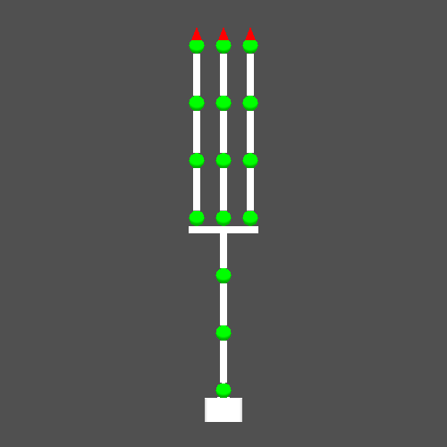
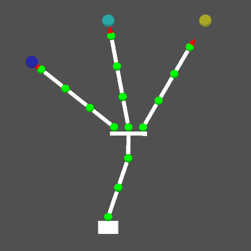
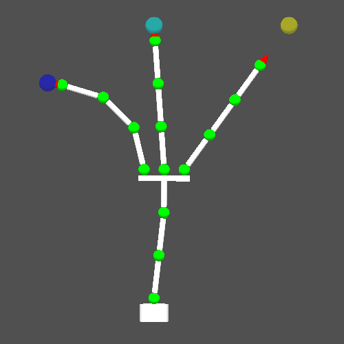
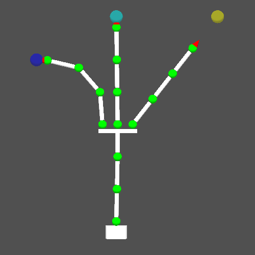
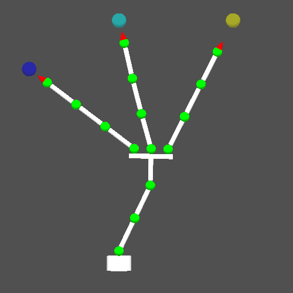

RoKiチュートリアル: ロボットアームの逆運動学(その2)
====================================================================================================
Copyright (C) Tomomichi Sugihara (Zhidao)

 - 2024.11.11. 作成 Zhidao
 - 2024.11.23. 最終更新 Zhidao

----------------------------------------------------------------------------------------------------

# IKセルの登録とIKアトリビュートについて

[前回](tutorial_roki005.md)紹介した逆運動学について、もう少し詳しく見ていきます。

エフェクタ変位の目標を指定する関数には、次の5種類があります。

 - `rkChainRegisterIKCellWldPos()` … リンク座標系内のある点の世界座標系における位置
 - `rkChainRegisterIKCellWldAtt()` … リンク座標系の世界座標系における姿勢
 - `rkChainRegisterIKCellL2LPos()` … リンク座標系内のある点の、別のリンク座標系における位置
 - `rkChainRegisterIKCellL2LAtt()` … リンク座標系の、別のリンク座標系における姿勢
 - `rkChainRegisterIKCellCOM()` … 世界座標系における重心の位置

対象となるリンクIDは、前回のサンプルプログラムに示したように
```C
  rkIKAttrSetLinkID( &attr, &chain, name );
```
または
```C
  attr.id = rkChainFindLinkID( &chain, name );
```
として指定します。

「リンク座標系内のある点」の位置は、`attr`の`attention_point`フィールドで指定できます。
これには
```C
  rkIKAttrSetAttentionPoint( &attr, x, y, z );
```
または
```C
  rkIKAttrCopyAttentionPoint( &attr, &pos );
```
を使うと良いでしょう。
`x`、`y`、`z`は`double`型変数、`pos`は`zVec3D`インスタンスです。
対応するマスクは`RK_IK_ATTR_MASK_ATTENTION_POINT`です。

前回のサンプルプログラムでは、これを陽に与えていませんでした。
この場合はリンク座標系原点が`attention_point`となります。

`rkChainRegisterIKCellL2LPos()`、`rkChainRegisterIKCellL2LAtt()`における「別のリンク」は、
`attr`の`id_sub`フィールドで指定できます。
これは
```C
  rkIKAttrSetLinkID2( &attr, &chain, name );
```
または
```C
  attr.id_sub = rkChainFindLinkID( &chain, name );
```
とすれば良いです。
対応するマスクは`RK_IK_ATTR_MASK_ID_SUB`です。

IKアトリビュートを使って、最適化計算における$`\boldsymbol{W}_{\mathrm{E}}`$を指定することもできます。
この場合は
```C
  rkIKAttrSetWeight( &attr, w1, w2, w3 );
```
として下さい。
各IKセルは3成分1セットとしているので、このような書き方になります。
対応するマスクは`RK_IK_ATTR_MASK_WEIGHT`です。
デフォルトでは、重みは全て1.0となります。

3成分1セットと書きましたが、場合によっては$`x`$、$`y`$、$`z`$成分のうち一つまたは二つだけを指定したいこともあります。
たとえば$`x`$、$`y`$成分の目標だけを指定したい時は、
```C
  rkIKCellSetActiveComponent( cell, RK_IK_CELL_MODE_X | RK_IK_CELL_MODE_Y );
```
のようにすればできます。

なお、
```C
  rkIKCellDisable( cell );
```
とすると、登録したIKセル`cell`が一時的に無効化されます（逆運動学計算時に考慮されません）。
無効化したIKセルを再び有効化したい場合には、
```C
  rkIKCellEnable( cell );
```
として下さい。
あるいは`rkIKCellSetRefVec()`や`rkIKCellSetRefAtt()`で目標値を指定すると、そのIKセルは自動的に有効化されます。


IKセルに名前をつけると、そのセルを後から参照することが出来ます。
たとえば
```C
  rkChainRegisterIKCellWldPos( &chain, "position", 0, &attr, RK_IK_ATTR_MASK_ID | RK_IK_ATTR_MASK_ATTENTION_POINT );
```
としておいて、
```C
  cell = rkChainFindIKCellByName( &chain, "position" );
```
とすれば、`cell`は上記のIKセルへのポインタとなります。


# 重み付き逆運動学と優先度付き逆運動学

複数のエフェクタを持つ冗長なロボットでは、エフェクタ変位の目標に**重み**や**優先度**を設定することができます。
たとえば人が座ったまま、右手と左手で別々のものを持とうとする時、その二つのものが離れて置かれている場合には両方をいっぺんに持つことは出来ません。
評価関数の中にある重み行列$`\boldsymbol{W}_{\mathrm{E}}`$は、上記のような状況で、左手側と右手側のものそれぞれを持ちたい気持ちがどれくらい強いかを定量化するものです。
すなわち、より大きな重みをかけられている$`\boldsymbol{e}(\boldmath{q})`$成分の方がより小さくなるような最適化がなされます。
このような定式化がなされる逆運動学は、**重み付き逆運動学**と呼ばれます。
処理としては、上に紹介した`rkIKAttrSetWeight()`を用いてそれぞれの`rkIKCell`に課す重みを指定するだけです。

重み付き逆運動学では、たとえば右手側のものへの到達に対応する重みをいくら大きくしても、結局両方とも手が届かないという結果になってしまいます。
実際の場面では、右手側にあるものは絶対持ちたい、もし持てるならば左手側にあるものも持ちたい、ということが多いでしょう。
このような持ちたい気持ちの違いは、`rkChainRegisterIKCellWldPos()`の第3引数である優先度によって表すことができます。
異なる優先度が指定された逆運動学は、**優先度付き逆運動学**と呼ばれます。

重み付き逆運動学・優先度付き逆運動学のサンプルコードを示します。
次のZTKデータを、`tri_arm.ztk`として保存して下さい。
```
[roki::chain]
name: tri_arm

[zeo::optic]
name: white
ambient:  1.0, 1.0, 1.0
diffuse:  1.0, 1.0, 1.0
specular: 0.0, 0.0, 0.0
esr: 1.0

[zeo::optic]
name: green
ambient:  0.0, 1.0, 0.0
diffuse:  0.0, 1.0, 0.0
specular: 0.0, 0.0, 0.0
esr: 1.0

[zeo::optic]
name: red
ambient:  1.0, 0.0, 0.0
diffuse:  1.0, 0.0, 0.0
specular: 0.0, 0.0, 0.0
esr: 1.0

[zeo::shape]
name: base
type: cylinder
optic: white
center: 0, 0, 0
center: 0, 0, 0.06
radius: 0.05

[zeo::shape]
name: shaft
type: cylinder
optic: white
center: 0, 0, 0.02
center: 0, 0, 0.13
radius: 0.01

[zeo::shape]
name: joint
type: sphere
optic: green
center: 0, 0, 0
radius: 0.02

[zeo::shape]
name: fork_base
type: box
optic: white
center: 0, 0, 0.12
depth: 0.02
height: 0.02
width: 0.18

[zeo::shape]
name: hand
type: cone
optic: red
center: 0, 0, -0.05
vert: 0, 0, 0
radius: 0.02

% 0:base
[roki::link]
name: base
jointtype: fixed
frame: {
 1, 0, 0, 0,
 0, 1, 0, 0,
 0, 0, 1,-0.08
}
shape: base

[roki::link]
name: link01
jointtype: spherical
mass: 1.0
COM: auto
inertia: auto
frame: {
 1, 0, 0, 0,
 0, 1, 0, 0,
 0, 0, 1, 0.08
}
parent: base
shape: joint, shaft

[roki::link]
name: link02
jointtype: spherical
mass: 1.0
COM: auto
inertia: auto
frame: {
 1, 0, 0, 0,
 0, 1, 0, 0,
 0, 0, 1, 0.15
}
parent: link01
shape: joint, shaft

[roki::link]
name: link03
jointtype: spherical
mass: 1.0
COM: auto
inertia: auto
frame: {
 1, 0, 0, 0,
 0, 1, 0, 0,
 0, 0, 1, 0.15
}
parent: link02
shape: joint, shaft, fork_base

% 1st fork
[roki::link]
name: link11
jointtype: spherical
mass: 0.6
COM: auto
inertia: auto
frame: {
 1, 0, 0, 0,
 0, 1, 0,-0.07,
 0, 0, 1, 0.15
}
parent: link03
shape: joint, shaft

[roki::link]
name: link12
jointtype: spherical
mass: 0.6
COM: auto
inertia: auto
frame: {
 1, 0, 0, 0,
 0, 1, 0, 0,
 0, 0, 1, 0.15
}
parent: link11
shape: joint, shaft

[roki::link]
name: link13
jointtype: spherical
mass: 0.6
COM: auto
inertia: auto
frame: {
 1, 0, 0, 0,
 0, 1, 0, 0,
 0, 0, 1, 0.15
}
parent: link12
shape: joint, shaft

[roki::link]
name: link14
jointtype: spherical
mass: 0.6
COM: auto
inertia: auto
frame: {
 1, 0, 0, 0,
 0, 1, 0, 0,
 0, 0, 1, 0.15
}
parent: link13
shape: joint

[roki::link]
name: hand1
jointtype: fixed
mass: 0.5
COM: auto
inertia: auto
frame: {
 1, 0, 0, 0,
 0, 1, 0, 0,
 0, 0, 1, 0.05
}
parent: link14
shape: hand

% 2nd fork
[roki::link]
name: link21
jointtype: spherical
mass: 0.6
COM: auto
inertia: auto
frame: {
 1, 0, 0, 0,
 0, 1, 0, 0,
 0, 0, 1, 0.15
}
parent: link03
shape: joint, shaft

[roki::link]
name: link22
jointtype: spherical
mass: 0.6
COM: auto
inertia: auto
frame: {
 1, 0, 0, 0,
 0, 1, 0, 0,
 0, 0, 1, 0.15
}
parent: link21
shape: joint, shaft

[roki::link]
name: link23
jointtype: spherical
mass: 0.6
COM: auto
inertia: auto
frame: {
 1, 0, 0, 0,
 0, 1, 0, 0,
 0, 0, 1, 0.15
}
parent: link22
shape: joint, shaft

[roki::link]
name: link24
jointtype: spherical
mass: 0.6
COM: auto
inertia: auto
frame: {
 1, 0, 0, 0,
 0, 1, 0, 0,
 0, 0, 1, 0.15
}
parent: link23
shape: joint

[roki::link]
name: hand2
jointtype: fixed
mass: 0.5
COM: auto
inertia: auto
frame: {
 1, 0, 0, 0,
 0, 1, 0, 0,
 0, 0, 1, 0.05
}
parent: link24
shape: hand

% 3rd fork
[roki::link]
name: link31
jointtype: spherical
mass: 0.6
COM: auto
inertia: auto
frame: {
 1, 0, 0, 0,
 0, 1, 0, 0.07,
 0, 0, 1, 0.15
}
parent: link03
shape: joint, shaft

[roki::link]
name: link32
jointtype: spherical
mass: 0.6
COM: auto
inertia: auto
frame: {
 1, 0, 0, 0,
 0, 1, 0, 0,
 0, 0, 1, 0.15
}
parent: link31
shape: joint, shaft

[roki::link]
name: link33
jointtype: spherical
mass: 0.6
COM: auto
inertia: auto
frame: {
 1, 0, 0, 0,
 0, 1, 0, 0,
 0, 0, 1, 0.15
}
parent: link32
shape: joint, shaft

[roki::link]
name: link34
jointtype: spherical
mass: 0.6
COM: auto
inertia: auto
frame: {
 1, 0, 0, 0,
 0, 1, 0, 0,
 0, 0, 1, 0.15
}
parent: link33
shape: joint

[roki::link]
name: hand3
jointtype: fixed
mass: 0.5
COM: auto
inertia: auto
frame: {
 1, 0, 0, 0,
 0, 1, 0, 0,
 0, 0, 1, 0.05
}
parent: link34
shape: hand
```
この姿を
```sh
% rk_pen tri_arm.ztk -auto
```
として可視化すると、次のような3本アームロボットであることが分かります。
関節は全て球面関節となっています。



そして、次のコードを保存してコンパイル・実行してみて下さい。
```C
#include <roki/rk_chain.h>

void output_result(rkChain *chain)
{
  FILE *fp;

  fp = fopen( "result.ztk", "w" );
  rkChainInitFPrintZTK( fp, chain );
  fclose( fp );
}

void output_target(zVec3D ref[])
{
  FILE *fp;

  fp = fopen( "target.ztk", "w" );
  fprintf( fp, "[zeo::optic]\n" );
  fprintf( fp, "name: blue\n" );
  fprintf( fp, "ambient:  0.0, 0.0, 1.0\n" );
  fprintf( fp, "diffuse:  0.0, 0.0, 1.0\n" );
  fprintf( fp, "specular: 0.0, 0.0, 0.0\n" );
  fprintf( fp, "esr: 1.0\n" );
  fprintf( fp, "alpha: 0.5\n" );
  fprintf( fp, "[zeo::optic]\n" );
  fprintf( fp, "name: cyan\n" );
  fprintf( fp, "ambient:  0.0, 1.0, 1.0\n" );
  fprintf( fp, "diffuse:  0.0, 1.0, 1.0\n" );
  fprintf( fp, "specular: 0.0, 0.0, 0.0\n" );
  fprintf( fp, "esr: 1.0\n" );
  fprintf( fp, "alpha: 0.5\n" );
  fprintf( fp, "[zeo::optic]\n" );
  fprintf( fp, "name: yellow\n" );
  fprintf( fp, "ambient:  1.0, 1.0, 0.0\n" );
  fprintf( fp, "diffuse:  1.0, 1.0, 0.0\n" );
  fprintf( fp, "specular: 0.0, 0.0, 0.0\n" );
  fprintf( fp, "esr: 1.0\n" );
  fprintf( fp, "alpha: 0.5\n" );
  fprintf( fp, "[zeo::shape]\n" );
  fprintf( fp, "name: target1\n" );
  fprintf( fp, "type: sphere\n" );
  fprintf( fp, "optic: blue\n" );
  fprintf( fp, "center: " ); zVec3DFPrint( fp, &ref[0] );
  fprintf( fp, "radius: 0.03\n" );
  fprintf( fp, "[zeo::shape]\n" );
  fprintf( fp, "name: target2\n" );
  fprintf( fp, "type: sphere\n" );
  fprintf( fp, "optic: cyan\n" );
  fprintf( fp, "center: " ); zVec3DFPrint( fp, &ref[1] );
  fprintf( fp, "radius: 0.03\n" );
  fprintf( fp, "[zeo::shape]\n" );
  fprintf( fp, "name: target3\n" );
  fprintf( fp, "type: sphere\n" );
  fprintf( fp, "optic: yellow\n" );
  fprintf( fp, "center: " ); zVec3DFPrint( fp, &ref[2] );
  fprintf( fp, "radius: 0.03\n" );
  fclose( fp );
}

void output_error(rkChain *chain, rkIKCell *cell[], zVec3D ref[])
{
  zVec3D error;
  int i;

  for( i=0; i<3; i++ ){
    printf( "error at hand%d = %g\n", i, zVec3DNorm( zVec3DSub( &ref[i], rkChainLinkWldPos(chain,cell[i]->data.attr.id), &error ) ) );
  }
}

int main(int argc, char *argv[])
{
  rkChain chain;
  rkIKAttr attr;
  zVec dis;
  rkIKCell *cell[3];
  zVec3D ref[3];

  rkChainReadZTK( &chain, "tri_arm.ztk" );
  dis = zVecAlloc( rkChainJointSize(&chain) );
  rkChainFK( &chain, dis );
  rkChainRegisterIKJointAll( &chain, 0.01 );

  rkIKAttrSetLinkID( &attr, &chain, "hand1" );
  rkIKAttrSetWeight( &attr, 1.0, 1.0, 1.0 );
  cell[0] = rkChainRegisterIKCellWldPos( &chain, NULL, 0, &attr, RK_IK_ATTR_MASK_ID | RK_IK_ATTR_MASK_WEIGHT );
  zVec3DCopy( rkChainLinkWldPos( &chain, attr.id ), &ref[0] );
  rkIKAttrSetLinkID( &attr, &chain, "hand2" );
  cell[1] = rkChainRegisterIKCellWldPos( &chain, NULL, 0, &attr, RK_IK_ATTR_MASK_ID | RK_IK_ATTR_MASK_WEIGHT );
  zVec3DCopy( rkChainLinkWldPos( &chain, attr.id ), &ref[1] );
  rkIKAttrSetLinkID( &attr, &chain, "hand3" );
  rkIKAttrSetWeight( &attr, 1.0, 1.0, 1.0 );
  cell[2] = rkChainRegisterIKCellWldPos( &chain, NULL, 0, &attr, RK_IK_ATTR_MASK_ID | RK_IK_ATTR_MASK_WEIGHT );
  zVec3DCopy( rkChainLinkWldPos( &chain, attr.id ), &ref[2] );

  ref[0].c.y -= 0.3;
  ref[0].c.z -= 0.2;
  ref[2].c.y += 0.4;
  rkIKCellSetRefVec( cell[0], &ref[0] );
  rkIKCellSetRefVec( cell[1], &ref[1] );
  rkIKCellSetRefVec( cell[2], &ref[2] );
  rkChainIK( &chain, dis, zTOL, 0 );

  output_error( &chain, cell, ref );
  output_result( &chain );
  output_target( ref );
  zVecFree( dis );
  rkChainDestroy( &chain );
  return 0;
}
```

`output_result()`と`output_target()`は結果の可視化のための関数、`output_error()`は手先位置誤差を表示する関数で、逆運動学に関する処理は`main()`関数に書いてあります。
要点だけ抜き出すと、まず
```C
  rkIKAttrSetLinkID( &attr, &chain, "hand1" );
  rkIKAttrSetWeight( &attr, 1.0, 1.0, 1.0 );
  cell[0] = rkChainRegisterIKCellWldPos( &chain, NULL, 0, &attr, RK_IK_ATTR_MASK_ID | RK_IK_ATTR_MASK_WEIGHT );
```
として、リンク`hand1`のIKセルの重みを3成分とも1.0とし、`rkChainRegisterIKCellWldPos()`を使って登録しています。
マスクが`RK_IK_ATTR_MASK_ID | RK_IK_ATTR_MASK_WEIGHT`となっていることにご注意下さい。
次いで、
```C
  zVec3DCopy( rkChainLinkWldPos( &chain, attr.id ), &ref[0] );
```
としてリンク`hand1`の初期位置をいったん目標位置`ref[0]`にコピーしています。
同様の処理を`hand2`、`hand3`についても行っています。
`hand2`には重みを陽に指定していませんので、デフォルト値の1.0となっています。

`hand1`の目標位置`ref[0]`と`hand2`の目標位置`ref[2]`のy成分にオフセットを与えてから、逆運動学を解きます。
```C
  ref[0].c.y -= 0.3;
  ref[0].c.z -= 0.2;
  ref[2].c.y += 0.4;
  rkIKCellSetRefVec( cell[0], &ref[0] );
  rkIKCellSetRefVec( cell[1], &ref[1] );
  rkIKCellSetRefVec( cell[2], &ref[2] );
  rkChainIK( &chain, dis, zTOL, 0 );
```
結果は`result.ztk`に保存されます。
また、分かりやすいようにそれぞれの手先の目標位置を`target.ztk`として可視化出来るようにしています。
```sh
% rk_pen tri_arm.ztk -env target.ztk -init result.ztk -auto
```
とすれば、次の絵が表示されるはずです。



また、プログラムを実行した際には標準出力に次のように表示されると思います（値は処理系に依存して多少異なるかも知れません）。
```
error at hand0 = 0.00774403
error at hand1 = 0.025178
error at hand2 = 0.0984423
```
`hand3`の目標位置が作業空間の外にあるので、それに引っ張られる形で`hand1`と`hand2`の手先位置にも誤差が出ています。

試しに、コード中で重みを指定している箇所を次のように変更してみましょう。
```C
  rkIKAttrSetLinkID( &attr, &chain, "hand1" );
  rkIKAttrSetWeight( &attr, 10.0, 10.0, 10.0 );
  cell[0] = rkChainRegisterIKCellWldPos( &chain, NULL, 0, &attr, RK_IK_ATTR_MASK_ID | RK_IK_ATTR_MASK_WEIGHT );
  ...
  rkIKAttrSetLinkID( &attr, &chain, "hand3" );
  rkIKAttrSetWeight( &attr, 0.1, 0.1, 0.1 );
  cell[2] = rkChainRegisterIKCellWldPos( &chain, NULL, 0, &attr, RK_IK_ATTR_MASK_ID | RK_IK_ATTR_MASK_WEIGHT );
```
結果を同様に可視化すると、次のような絵が現れます。



プログラム実行時に標準出力には次のように表示されます。
```
error at hand0 = 9.80485e-10
error at hand1 = 0.00322129
error at hand2 = 0.120817
```
`hand1`、`hand2`、`hand3`のIKセルの重みをそれぞれ10.0、1.0、0.1としたので、この順に誤差をより減らした結果になっていることが見て取れると思います。
`hand1`の誤差はだいぶ減りましたが、`hand2`の誤差はそれほど減っていません。

次に優先度付き逆運動学を試してみましょう。
先程のサンプルコードでIKセルを登録していた部分を、次のように変更してみて下さい。
```C
  rkIKAttrSetLinkID( &attr, &chain, "hand1" );
  cell[0] = rkChainRegisterIKCellWldPos( &chain, NULL, 2, &attr, RK_IK_ATTR_MASK_ID );
  zVec3DCopy( rkChainLinkWldPos( &chain, attr.id ), &ref[0] );
  rkIKAttrSetLinkID( &attr, &chain, "hand2" );
  cell[1] = rkChainRegisterIKCellWldPos( &chain, NULL, 1, &attr, RK_IK_ATTR_MASK_ID );
  zVec3DCopy( rkChainLinkWldPos( &chain, attr.id ), &ref[1] );
  rkIKAttrSetLinkID( &attr, &chain, "hand3" );
  cell[2] = rkChainRegisterIKCellWldPos( &chain, NULL, 0, &attr, RK_IK_ATTR_MASK_ID );
  zVec3DCopy( rkChainLinkWldPos( &chain, attr.id ), &ref[2] );
```
優先度は数字の大小だけが意味を持ちます。
数字が大きいほど優先度が高いことを表します。
したがってこの例では、`hand1`、`hand2`、`hand3`の順に優先度が高いことになります。

結果を可視化したものは次のような絵になります。



プログラム実行時に標準出力には次のように表示されます。
```
error at hand0 = 5.25477e-09
error at hand1 = 9.54112e-05
error at hand2 = 0.136638
```
`hand3`よりも`hand2`の優先度が高いので、重み付き逆運動学の結果よりも`hand1`と`hand2`の誤差が小さくなっているのが分かります。

優先度を次のように変更した結果も見てみましょう。
```C
  rkIKAttrSetLinkID( &attr, &chain, "hand1" );
  cell[0] = rkChainRegisterIKCellWldPos( &chain, NULL, 0, &attr, RK_IK_ATTR_MASK_ID );
  zVec3DCopy( rkChainLinkWldPos( &chain, attr.id ), &ref[0] );
  rkIKAttrSetLinkID( &attr, &chain, "hand2" );
  cell[1] = rkChainRegisterIKCellWldPos( &chain, NULL, 1, &attr, RK_IK_ATTR_MASK_ID );
  zVec3DCopy( rkChainLinkWldPos( &chain, attr.id ), &ref[1] );
  rkIKAttrSetLinkID( &attr, &chain, "hand3" );
  cell[2] = rkChainRegisterIKCellWldPos( &chain, NULL, 2, &attr, RK_IK_ATTR_MASK_ID );
  zVec3DCopy( rkChainLinkWldPos( &chain, attr.id ), &ref[2] );
```
次のような絵になります。



また、誤差は次のようになります。
```
error at hand0 = 0.0425921
error at hand1 = 0.0456912
error at hand2 = 0.0944273
```
この例では`hand2`の優先度が最も高いのですが、目標位置が作業空間外にあるため、そこに向けて目一杯`hand2`を近付けた上で、その時の誤差を維持したまま`hand2`、`hand1`を目標位置に近付けているわけです。

3つの手先の目標位置や、重み、優先度をいろいろ変えて試してみて下さい。

重み付き逆運動学と優先度付き逆運動学は併存し得ます。
同一優先度の目標については、それぞれの重み付けが反映されます。
