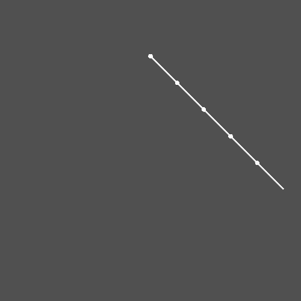
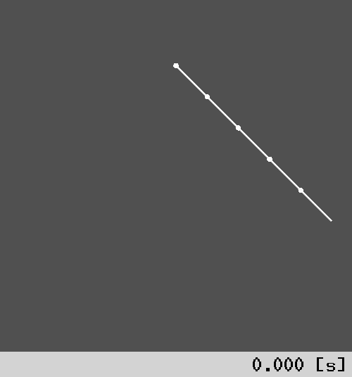
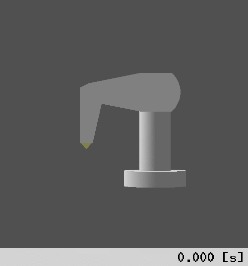

RoKiチュートリアル: ロボットアームの順動力学シミュレーション
====================================================================================================
Copyright (C) Tomomichi Sugihara (Zhidao)

 - 2024.11.27. 作成 Zhidao
 - 2024.12.15. 最終更新 Zhidao

----------------------------------------------------------------------------------------------------

# 順動力学

[第4回](tutorial_roki004.md)で説明したように、各関節で駆動トルクを発揮させたときに生じる関節加速度を求める計算を**順動力学**と呼びます。
逆動力学は、ある運動を実現するために関節が発揮しなければならないトルクを逆算する計算ですので、主に制御や解析の目的で用います。
それに対し順動力学は、主に与えた駆動トルクに対するロボットの振る舞いをシミュレーションする目的で用います。
RoKiでは、Walker、Orinによる合成剛体法を採用しています。

M. W. Walker and D. E. Orin, "Efficient Dynamic Computer Simulation of Robotic Mechanisms," Transactions of the ASME, Journal of Dynamic Systems, Measurement, and Control, Vol. 104, pp. 205-211, 1982.

分かりやすい例として、多重振子の運動をシミュレーションしてみましょう。
次のコードを作成して下さい。
```C
#include <roki/roki.h>

rkChain *create_pendula(rkChain *chain, double length, int num)
{
  int i;
  char name[BUFSIZ];
  double d;
  rkMP mp;

  rkChainInit( chain );
  zNameSet( chain, "pendula" );
  rkLinkArrayAlloc( rkChainLinkArray(chain), num + 1 );
  d = length / num;
  rkMPSetMass( &mp, 1.0/num );
  zVec3DCreate( rkMPCOM(&mp), 0.5*d, 0, 0 );
  zMat3DCreate( rkMPInertia(&mp),
    rkMPMass(&mp)*(0.03+d*d)/12, 0, 0,
    0, rkMPMass(&mp)*(0.03+d*d)/12, 0,
    0, 0, rkMPMass(&mp)*0.03/6 );
  /* base */
  rkLinkInit( rkChainLink(chain,0) );
  zVec3DCreate( rkChainLinkOrgPos(chain,0), 0, 0, length*(num-1)/num );
  zMat3DFromZYX( rkChainLinkOrgAtt(chain,0), 0, zDeg2Rad(90), 0 );
  zNameSet( rkChainLink(chain,0), "base" );
  rkJointAssignByStr( rkChainLinkJoint(chain,0), "revolute" );
  /* pendulum */
  for( i=1; i<num; i++ ){
    sprintf( name, "link%d", i );
    rkLinkInit( rkChainLink(chain,i) );
    rkLinkSetMP( rkChainLink(chain,i), &mp );
    zVec3DCreate( rkChainLinkOrgPos(chain,i), d, 0, 0 );
    zNameSet( rkChainLink(chain,i), name );
    rkJointAssignByStr( rkChainLinkJoint(chain,i), "revolute" );
    rkLinkAddChild( rkChainLink(chain,i-1), rkChainLink(chain,i) );
  }
  /* tip */
  rkLinkInit( rkChainLink(chain,num) );
  zVec3DCreate( rkChainLinkOrgPos(chain,num), d, 0, 0 );
  zNameSet( rkChainLink(chain,num), "tip" );
  rkJointAssignByStr( rkChainLinkJoint(chain,num), "fixed" );
  rkLinkAddChild( rkChainLink(chain,num-1), rkChainLink(chain,num) );

  rkChainSetJointIDOffset( chain );
  rkChainUpdateCRBMass( chain );
  rkChainUpdateFK( chain );
  rkChainUpdateID( chain );
  return chain;
}

zVec chain_fd(double t, zVec dis, zVec vel, void *chain, zVec acc)
{
  zVec trq;
  int i;

  trq = zVecAlloc( zVecSizeNC( dis ) );
  for( i=0; i<zVecSizeNC(trq); i++ )
    zVecSetElem( trq, i, -0.1*zVecElem(vel,i) );
  rkChainFD( (rkChain *)chain, dis, vel, trq, acc );
  zVecFree( trq );
  return acc;
}

#define T  3.0
#define DT 0.001

#define DEFAULT_N 5

int main(int argc, char *argv[])
{
  zODE2 ode;
  rkChain chain;
  zVec dis, vel, acc;
  int size, i, step;
  FILE *fp;

  create_pendula( &chain, 1.0, argc > 1 ? atoi( argv[1] ) : DEFAULT_N );
  rkChainWriteZTK( &chain, "pendula.ztk" );
  size = rkChainJointSize( &chain );
  dis = zVecAlloc( size );
  vel = zVecAlloc( size );
  acc = zVecAlloc( size );
  zVecSetElem( dis, 0, zDeg2Rad(45) );
  rkChainFK( &chain, dis );
  rkChainUpdateID( &chain );

  zODE2Assign( &ode, Sympl, NULL, NULL, NULL, NULL );
  zODE2Init( &ode, size, 0, chain_fd );
  fp = fopen( "test.zvs", "w" );
  fprintf( fp, "%g ", DT );
  zVecFPrint( fp, dis );
  step = T / DT;
  for( i=0; i<=step; i++ ){
    zODE2Update( &ode, i*DT, dis, vel, DT, &chain );
    fprintf( fp, "%g ", DT );
    zVecFPrint( fp, dis );
  }
  fclose( fp );
  zODE2Destroy( &ode );
  zVecFreeAtOnce( 3, dis, vel, acc );
  rkChainDestroy( &chain );
  return 0;
}
```
最初の`create_pendula()`という関数は、多重振子モデルをキネマティックチェーンとして自動作成するものです。
`length`には全長、`num`には振子の数を指定します。
今回の本題には関係しないですが、ZTKファイルではなくプログラム中でキネマティックチェーンを作成する際のサンプルともなりますので、軽く説明しておきます。

最初の`rkChainInit()`は必須で、`rkChain`構造体の全てのメンバ変数を初期化します。
`zNameSet()`は必須ではありませんが、モデルを名前で識別できるように付けておく方がベターです。
`rkLinkArrayAlloc()`でリンク（`rkLink`インスタンス）の配列を作成しています。
続く処理で、振子部の単一リンクの質量特性（`rkMP`インスタンス）を作成しています。
ここは適当に、中実円柱状のリンクを仮定して値を決めています。

土台リンクを`base`、`num`個の振子部リンクを`link1`〜、先端を`tip`とそれぞれ名付けることにします。
それぞれのリンクは`rkLinkInit()`で初期化する必要があります。
`zNameSet()`は、運動計算するだけならば不要ですが、最後にこのモデルをZTKファイルに書き出すことを考えて付けています。
`base`座標系には、振子が適当な高さから下に向かって吊り下がるように、オフセットと回転を加えています。
`rkJointAssignByStr()`は、リンクの関節タイプを指定し`rkJoint`のメンバ変数とメソッド群を初期化する必須の処理です。
振子部`link〜`には質量特性が必要なので、先程作成したものを`rkLinkSetMP()`でコピーします。
最後に`rkLinkAddChild()`でi番目リンクをi-1番目リンクの子リンクに追加します。

全てのリンクの構造が定義されたら、
```C
  rkChainSetJointIDOffset( chain );
  rkChainUpdateCRBMass( chain );
  rkChainUpdateFK( chain );
  rkChainUpdateID( chain );
```
として
 - それぞれのリンク関節の変位に対応する値が保持される関節変位ベクトルの先頭要素番号（関節IDオフセット）
 - リンク系慣性行列計算処理用の合成剛体（Composite Rigid Body）の質量
 - 全リンクの初期位置・姿勢
 - 全リンクの初期速度・加速度・関節力

をそれぞれ計算しています。
これらも運動学・力学を正しく計算するために必須です。

さて、本題の順動力学シミュレーション計算処理について説明します。
`main()`関数を見て下さい。
`zODE2`は、2階常微分方程式の初期値問題を数値的に解くためのクラスです（運動方程式は2階常微分方程式であることに注意して下さい）。

最初に`create_pendula()`で多重振子モデルを作った後、それを`rkChainWriteZTK()`で pendula.ztk というファイルに書き出します。
これは後ほど結果をアニメーションで見るために使います。
`rkChainJointSize()`で計算した関節変位ベクトルのサイズを使って関節変位ベクトル、関節速度ベクトル、関節加速度ベクトルを生成します。
その後に
```C
  zVecSetElem( dis, 0, zDeg2Rad(45) );
  rkChainFK( &chain, dis );
```
とすることで、いちばん根本の関節だけ45度傾け、さらに
```C
  rkChainUpdateID( &chain );
```
として全リンクの初期速度・加速度を更新します。
速度・加速度はゼロのままなので、これは不要なのでは？と思うかも知れませんが、姿勢が変わると重力加速度の寄与分が変わるので必須です。

続く
```C
  zODE2Assign( &ode, Sympl, NULL, NULL, NULL, NULL );
  zODE2Init( &ode, size, 0, chain_fd );
```
は常微分方程式ソルバに関する処理で、詳しくはZMのチュートリアルにて述べますが、Symplectic法（機械システムのシミュレーションに特化した、比較的精度も計算効率も良い解法）を選択しています。
`zODE2Init()`の第2引数には一般化座標の次元（この例では`rkChainJointSize()`で得られた値）を与えます。
第4引数に与えるのは常微分方程式の記述関数へのポインタで、これはプロトタイプ
```C
zVec (*)(double t, zVec dis, zVec vel, void *utility, zVec acc);
```
を持つ必要があります。
元の常微分方程式が
$$
\ddot{\boldsymbol{x}}=\boldsymbol{f}(t,\boldsymbol{x},\dot{\boldsymbol{x}})
$$
ならば、`t`が$t$、`dis`が$\boldsymbol{x}$、`vel`が$\dot{\boldsymbol{x}}$、`acc`が$\ddot{\boldsymbol{x}}$にそれぞれ相当します。
`utility`は、関数値の計算に特殊なデータ型を必要とする場合の、そのデータへのポインタです。
これは後ほど実例を示して説明します。

その後は出力ファイルを開いて、`step`ステップ分のシミュレーションを回します。
`zODE2Update()`が常微分方程式に基づいて状態更新する関数で、第2引数は時刻、第3引数は変位ベクトル、第4引数は速度ベクトル、第5引数は離散時間幅、第6引数は常微分方程式記述関数の第4引数`utility`として与えるポインタです（このサンプルプログラムではキネマティックチェーンへのポインタ`chain`をそのまま与えています）。
.zvsファイルのフォーマットとなるよう、毎ステップ離散時間幅`dt`と関節変位ベクトル`dis`をファイルに出力します。
`step`分の計算が終わったら出力ファイルを閉じ、常微分方程式ソルバ、各種ベクトル、キネマティックチェーンをそれぞれ破棄して終了です。

最後に常微分方程式の記述関数`chain_fd()`の説明ですが、`dis`と同じサイズの関節トルクベクトル`trq`を最初に生成し、その$i$番目成分を、対応する関節速度に-0.1を乗じたものとしています。
これは、速度に比例して大きくなる抵抗トルク（粘性抵抗）トルクを与えていることに相当します。
`dis`、`vel`、`trq`が決まったので、
```C
  rkChainFD( (rkChain *)chain, dis, vel, trq, acc );
```
として順動力学を解き、関節加速度`acc`を求めています。
その後、`trq`を破棄してから`acc`を返り値として終了です。
第4引数には`rkChain`型ポインタを与えていることにご注意下さい。
プロトタイプではvoid型ポインタとなっているので、使う際には適切にキャストする必要があります。

プログラムをコンパイル＆実行すると、`pendula.ztk`と`test.zvs`が出来ますので、
```sh
% rk_anim pendula.ztk test.zvs -x 8 -bone -z 0.3
```
を実行（`-bone`オプションを忘れないで下さい）すると、次のようなアニメーションが見られます。



定量的な評価はしませんが、重力と粘性摩擦に従う自然な動きになっていることが、雰囲気として分かるでしょうか。


# 接触を伴う運動のシミュレーション

もう一つ、ロボット制御シミュレーションする際の参考になる例を示します。
次のコードを作成して下さい。
```C
#include <roki/roki.h>

int ext_wrench(rkChain *chain)
{
  zVec3D vel, extforce;
  const double kz = 100.0;
  const double cz = 1.0;
  const double mu = 0.3;
  rkLink *l;

  l = rkChainLink( chain, rkChainLinkNum(chain)-1 );
  zMulMat3DVec3D( rkLinkWldAtt(l), rkLinkLinVel(l), &vel );
  extforce.c.z = -zMin( kz * rkLinkWldPos(l)->c.z, 0 ) -zMax( cz * vel.c.z, 0 );
  extforce.c.x = -mu * extforce.c.z * zSgn(vel.c.x);
  extforce.c.y = -mu * extforce.c.z * zSgn(vel.c.y);
  zMulMat3DTVec3DDRC( rkLinkWldAtt(l), &extforce );
  rkLinkSetExtForce( l, &extforce, ZVEC3DZERO );
  return 1;
}

zVec chain_fd(double t, zVec dis, zVec vel, void *chain, zVec acc)
{
  zVec trq;
  int i;

  trq = zVecAlloc( zVecSizeNC( dis ) );
  for( i=0; i<zVecSizeNC(trq); i++ )
    zVecSetElem( trq, i, -0.1*zVecElem(vel,i) );
  ext_wrench( (rkChain *)chain );
  rkChainFD( (rkChain *)chain, dis, vel, trq, acc );
  zVecFree( trq );
  return acc;
}

#define T  3.0
#define DT 0.001

#define DEFAULT_N 5

int main(int argc, char *argv[])
{
  zODE2 ode;
  rkChain chain;
  zVec dis, vel, acc;
  int size, i, step;
  FILE *fp;

  rkChainReadZTK( &chain, "pendula.ztk" );
  size = rkChainJointSize( &chain );
  dis = zVecAlloc( size );
  vel = zVecAlloc( size );
  acc = zVecAlloc( size );
  zVecSetElem( dis, 0, zDeg2Rad(45) );
  rkChainUpdateFK( &chain );
  rkChainUpdateID( &chain );

  zODE2Assign( &ode, Sympl, NULL, NULL, NULL, NULL );
  zODE2Init( &ode, size, 0, chain_fd );
  fp = fopen( "test.zvs", "w" );
  fprintf( fp, "%g ", DT );
  zVecFPrint( fp, dis );
  step = T / DT;
  for( i=0; i<=step; i++ ){
    zODE2Update( &ode, i*DT, dis, vel, DT, &chain );
    fprintf( fp, "%g ", DT );
    zVecFPrint( fp, dis );
  }
  fclose( fp );
  zODE2Destroy( &ode );
  zVecFreeAtOnce( 3, dis, vel, acc );
  rkChainDestroy( &chain );
  return 0;
}
```

先に`main()`関数から説明します。
全体としては前回のサンプルコードとほとんど同じで、自動生成した`pendula.ztk`を読み込んで`rkChain`構造体を作成しているところのみが異なります。


`chain_fd()`もほとんど同じですが、順動力学を解く直前に次の1行を入れています。
```C
  ext_wrench( (rkChain *)chain );
```
この`ext_wrench()`の中身を見てみましょう。
まず、`chain`の先端リンクへのポインタ`l`を次のように取得します。
```C
  l = rkChainLink( chain, rkChainLinkNum(chain)-1 );
```
先端リンクは大きさを持たないので、この原点を多重振子の先端と見なせます。
位置は`rkLinkWldPos()`で直接参照できます。
速度`rkLinkWldVel()`は方向がリンク座標系におけるものなので、世界座標系におけるものに変換しましょう。
```C
  zMulMat3DVec3D( rkLinkWldAtt(l), rkLinkLinVel(l), &vel );
```
高さ$z=0$に水平な地面があり、これへのめり込み量$\varDelta z$およびその速さ$\varDelta \dot{z}$に対して次式で垂直抗力$f_{z}$が決まるものとします。
$$
f_{z}=-k_{z}\mathrm{max}\{\varDelta z,0\}-c_{z}\mathrm{max}\{\varDelta\dot{z},0\}
$$
ただし$k_{z}$、$c_{z}$はそれぞれ地面の弾性係数および粘性係数です。
またこの垂直抗力$f_{z}$と水平方向速度$v_{x}$、$v_{y}$に対して、動摩擦力$f_{x}$、$f_{y}$を次式のように決めます。
$$
f_{x}=-\mu f_{z}\mathop{\mathrm{sgn}}v_{x} \\
f_{y}=-\mu f_{z}\mathop{\mathrm{sgn}}v_{y}
$$
これを表しているのが次の3行です。
```C
  extforce.c.z = -zMin( kz * rkLinkWldPos(l)->c.z, 0 ) -zMax( cz * vel.c.z, 0 );
  extforce.c.x = -mu * extforce.c.z * zSgn(vel.c.x);
  extforce.c.y = -mu * extforce.c.z * zSgn(vel.c.y);
```
$k_{z}$、$c_{z}$、$\mu$は適当に次の値にしました。
```C
  const double kz = 100.0;
  const double cz = 1.0;
  const double mu = 0.3;
```
この力を、向きを先端リンク座標系から見たものに直した上で加えます。
```C
  zMulMat3DTVec3DDRC( rkLinkWldAtt(l), &extforce );
  rkLinkSetExtForce( l, &extforce, ZVEC3DZERO );
```
`rkLinkSetExtForce()`は、リンクに加える外力を指定するメソッドです。
第2引数が3軸力、第3引数がその力のかかる点です。
今は先端リンク原点に力がかかるとしているので、`ZVEC3DZERO`を与えています。

なお、6軸力（レンチ）を直接与えることも出来ます。
その場合は次のメソッドを用います。
```C
zVec6D *rkLinkSetExtWrench(rkLink *link, zVec6D *wrench);
```
このレンチはリンク原点にかかります。

プログラムをコンパイル＆実行すると、`test.zvs`が出来ますので、前回と同様
```sh
% rk_anim pendula.ztk test.zvs -x 8 -bone -z 0.3
```
としてみて下さい。
次のようなアニメーションが見られたでしょうか。



地面は描いていませんが、振子の挙動からなんとなく地面の存在を感じられるのが面白いところです。


# PUMAの関節角度制御シミュレーション

振子ではなく、モータを持つロボットの運動をシミュレートしてみましょう。
ロボットにある動作をさせたい時に、どのような駆動トルクを発生させればそれが出来るのか？を考えるのがロボット制御です。
「ある動作」が「ある姿勢に収束する動作」であるならば、計算トルク法という比較的簡単な方法が知られています。
これはLuh、Walker、Paulらが、逆動力学アルゴリズムのNewton-Euler法と一緒に次の論文で提案しました。

J. Y. S. Luh, M. W. Walker, and R. P. C. Paul, "On-Line Computational Scheme for Mechanical Manipulators," Transactions of the ASME, Journal of Dynamic Systems, Measurement, and Control, Vol. 102, pp. 69-76, 1980.

考え方は単純で、

 1. ある参照軌道${}^{\mathrm{d}}\bm{q}(t)$に追従するような関節変位$\bm{q}(t)$のダイナミクスを考える。たとえば次の2次遅れ系で設計できる。
$$
\ddot{\bm{q}}-{}^{\mathrm{d}}\ddot{\bm{q}}+2\zeta\omega_{\mathrm{n}}(\dot{\bm{q}}-{}^{\mathrm{d}}\dot{\bm{q}})+\omega_{\mathrm{n}}^{2}(\bm{q}-{}^{\mathrm{d}}\bm{q})=\bm{0}
$$
ただし、$\omega_{\mathrm{n}}$は系の固有角振動数、$\zeta$は減衰係数である。
 1. 上式を変形して
$$
\ddot{\bm{q}}={}^{\mathrm{d}}\ddot{\bm{q}}+2\zeta\omega_{\mathrm{n}}({}^{\mathrm{d}}\dot{\bm{q}}-\dot{\bm{q}})+\omega_{\mathrm{n}}^{2}({}^{\mathrm{d}}\bm{q}-\bm{q})
$$
とし、これを生じさせる駆動トルクを逆動力学により求める。

というものです。
次のサンプルプログラムを作成、実行してみて下さい。
```C
#include <roki/roki.h>

typedef struct{
  rkChain *chain;
  zVec ref;
  zVec trq;
  double omega;
  double zeta;
} fd_data_t;

zVec chain_fd(double t, zVec dis, zVec vel, void *data, zVec acc)
{
  fd_data_t *fd_data;

  fd_data = data;
  zVecSub( dis, fd_data->ref, acc );
  zVecMulDRC( acc, -zSqr( fd_data->omega ) );
  zVecCatDRC( acc, -2*fd_data->zeta*fd_data->omega, vel );
  rkChainID( fd_data->chain, dis, vel, acc, fd_data->trq );
  rkChainFD( fd_data->chain, dis, vel, fd_data->trq, acc );
  return acc;
}

#define T  1.0
#define DT 0.001

#define DEFAULT_N 5

int main(int argc, char *argv[])
{
  zODE2 ode;
  fd_data_t fd_data;
  rkChain chain;
  zVec dis, vel, acc;
  int size, i, step;
  FILE *fp;

  rkChainReadZTK( &chain, "puma.ztk" );
  size = rkChainJointSize( &chain );
  dis = zVecAlloc( size );
  vel = zVecAlloc( size );
  acc = zVecAlloc( size );

  fd_data.chain = &chain;
  fd_data.ref = zVecAlloc( size );
  fd_data.trq = zVecAlloc( size );
  fd_data.omega = zPIx2 * 3;
  fd_data.zeta  = 1.0;
  zVecSetElem( fd_data.ref, 1, -zDeg2Rad(45) );
  zVecSetElem( fd_data.ref, 2, -zDeg2Rad(45) );

  zODE2Assign( &ode, Regular, NULL, NULL, NULL, NULL );
  zODE2AssignRegular( &ode, RKF45 );
  zODE2Init( &ode, size, 0, chain_fd );
  fp = fopen( "test.zvs", "w" );
  fprintf( fp, "%g ", DT );
  zVecFPrint( fp, dis );
  step = T / DT;
  for( i=0; i<=step; i++ ){
    zODE2Update( &ode, i*DT, dis, vel, DT, &fd_data );
    fprintf( fp, "%g ", DT );
    zVecFPrint( fp, dis );
  }
  fclose( fp );
  zODE2Destroy( &ode );
  zVecFreeAtOnce( 5, dis, vel, acc, fd_data.ref, fd_data.trq );
  rkChainDestroy( &chain );
  return 0;
}
```
最初に定義した構造体
```C
typedef struct{
  rkChain *chain;
  zVec ref;
  zVec trq;
  double omega;
  double zeta;
} fd_data_t;
```
は、シミュレートするに当たって常微分方程式ソルバに与えなければならない情報をまとめたものです。
具体的には、キネマティックチェーンへのポインタ、関節変位の参照値`ref`、関節駆動トルク`trq`、設計ダイナミクス（2次遅れ系）の固有角振動数`omega`と減衰係数`zeta`を持たせています。
これを、ユーティリティデータとして`zODE2Update()`に渡します。

続く関数`chain_fd()`内で、関節加速度を計算しています。
第4引数は、上で定義した`fd_data_t`型データへのポインタですので、まずこれを陽に変換します（変換せずキャストするだけでも良いのですが、コードが煩雑になるので）。
```C
  fd_data_t *fd_data;

  fd_data = data;
```
上記の設計ダイナミクスに従って、ロボットの関節に発生させたい加速度を計算します。
この例では簡単のため、関節変位の参照値は一定である（つまり$\dot{\bm{q}}=\bm{0}$、$\ddot{\bm{q}}=\bm{0}$）としています。
```C
  zVecSub( dis, fd_data->ref, acc );
  zVecMulDRC( acc, -zSqr( fd_data->omega ) );
  zVecCatDRC( acc, -2*fd_data->zeta*fd_data->omega, vel );
```
「発生させたい加速度」の計算には、横着して、順動力学で求める加速度用のベクトル`acc`を使っています。
厳密にはこれらは区別されるべきですが、どうせ後で`acc`は上書きされるので使い回しています。
発生させたい加速度が求まれば、それを発生させる駆動トルクは逆動力学で計算できるのでした。
```C
  rkChainID( fd_data->chain, dis, vel, acc, fd_data->trq );
```
これを順動力学に与えれば、実際にはどのような加速度が発生するか計算できるというわけです。
```C
  rkChainFD( fd_data->chain, dis, vel, fd_data->trq, acc );
```
逆動力学に与えた加速度と順動力学で求めた加速度は同じものになるのだから、無駄なことをやっているのじゃないか？と思われるかも知れません。
この例に限って言えば、それは実は正しいです。
実用上は、逆動力学計算に用いたロボット質量特性が実際と異なっていたり、駆動トルク以外の外力がかかったりするなど、外乱がある場合にも適切に動作するかどうかを確認するのにシミュレーションを行うわけなので、そうした状況を模擬する処理を`rkChainID()`と`rkChainFD()`の間に入れるのが良いです。

`main()`関数は、難しいことはしていません。
まずPUMAモデルを読み込み、例によって`rkChainJointSize()`で求めたサイズの関節変位ベクトル、関節速度ベクトル、関節加速度ベクトルを作成します。
```C
  rkChainReadZTK( &chain, "puma.ztk" );
  size = rkChainJointSize( &chain );
  dis = zVecAlloc( size );
  vel = zVecAlloc( size );
  acc = zVecAlloc( size );
```
次いで、`fd_data_t`型データ`fd_data`の中身を作成しています。
キネマティックチェーンのポインタ（`chain`メンバ）には、作成したばかりの`chain`のアドレスを渡します。
参照関節変位ベクトル（`ref`メンバ）、関節駆動トルクベクトル（`trq`メンバ）は、どちらも関節変位ベクトルと同じサイズのものを作成します。
設計ダイナミクスの固有角振動数（`omega`メンバ）、減衰係数（`zeta`メンバ）はそれぞれ適当に$6\pi$（固有振動数3Hz）、$1.0$（臨界減衰）とします。
```C
  fd_data.chain = &chain;
  fd_data.ref = zVecAlloc( size );
  fd_data.trq = zVecAlloc( size );
  fd_data.omega = zPIx2 * 3;
  fd_data.zeta  = 1.0;
```
参照関節変位は関節1（肩昇降）と関節2（肘昇降）を、どちらも-45°とします。
関節を降ろす方向が正方向であることに注意して下さい。
```C
  zVecSetElem( fd_data.ref, 1, -zDeg2Rad(45) );
  zVecSetElem( fd_data.ref, 2, -zDeg2Rad(45) );
```
常微分方程式ソルバにはRunge-Kutta-Fehlberg法を使っています。
これはいわゆる埋め込み型Runge-Kutta法の一種で、4次解法と5次解法の誤差を比較しながら時間刻み幅を内部で自動的に調整するものです。
2階の常備分方程式に特化したものではなく、任意の階数の常微分方程式に対する解法なので、`zODE2Assign()`の第2引数を`Regular`とした上で、`zODE2AssignRegular()`マクロを使って指定しています。
```C
  zODE2Assign( &ode, Regular, NULL, NULL, NULL, NULL );
  zODE2AssignRegular( &ode, RKF45 );
```
シミュレーションを回すところは多重振子の例とほとんど同じです。
終了後の処理では、`fd_data`の中にメモリ確保した`ref`と`trq`も忘れず解放して下さい。
```C
  zVecFreeAtOnce( 5, dis, vel, acc, fd_data.ref, fd_data.trq );
```
次のコマンドをシェルで入力することにより、結果をアニメーションで観られます。
```sh
% rk_anim puma.ztk test.zvs -x 0.1 -y 4 -z 0.2 -pan 90
```


