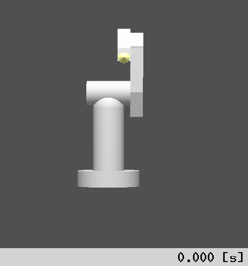
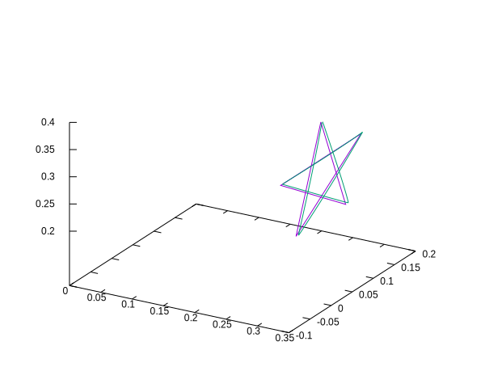
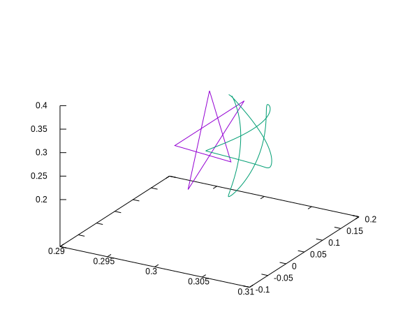

RoKiチュートリアル: ロボットアームの手先軌道追従制御シミュレーション
====================================================================================================
Copyright (C) Tomomichi Sugihara (Zhidao)

 - 2025.01.03. 作成 Zhidao
 - 2025.01.05. 最終更新 Zhidao

----------------------------------------------------------------------------------------------------

# 概要

基本的な運動学・力学計算の方法が分かったところで、実践的なロボット制御シミュレーションのプログラムを作ってみましょう。
と言っても半分お遊びで、PUMAの手先で星型（五芒星）を描いてみることにします。

基本的には、ここまでやった逆運動学・逆動力学・順動力学の応用です。
参照軌道の作り方は、(逆運動学その1)[tutorial_roki005.md]でやった8の字軌道を描かせる例とあまり変わりません。
軌道追従制御も、基本的には(前回)[tutorial_roki007.md]やった計算トルク法を適用します。
勘の良い人ならば自力で作ることも出来ますので、内容に入る前にいちどトライしてみるのも良いでしょう。

これまで作ったものに比べてちょっと長めのプログラムになるので、少しずつ進めていくことにします。


# 参照軌道の作成

星型の軌道は、$`y`$-$`z`$平面上に5つの点を配置し、それらを直線的につないでいくことで描きます。
ある点を中心にした半径一定の円周上に、360*2/5°間隔で点をとっていきます。
それらを順番に辿り、最後まで行ってからまた最初の点まで戻れば五芒星の完成です。
このような点列は、例えば次のように求めることができるでしょう。
```C
bool create_viapoints(zVec3DArray *viapoints)
{
  const zVec3D center = { { 0.3, 0.05, 0.3 } };
  const double radius = 0.1;
  double angle;
  int i;

  zVec3DArrayAlloc( viapoints, 6 );
  if( zArraySize(viapoints) != 6 ) return false;
  for( i=0; i<5; i++ ){
    angle = zPIx2 * 2 * i / 5;
    zVec3DCat( &center, radius*sin(angle), ZVEC3DY, zArrayElemNC(viapoints,i) );
    zVec3DCatDRC( zArrayElemNC(viapoints,i), radius*cos(angle), ZVEC3DZ );
  }
  zVec3DCopy( zArrayElemNC(viapoints,0), zArrayElemNC(viapoints,5) );
  return true;
}
```
横着して、中心点の座標(0.3, 0.05, 0.3)および半径0.1は関数の中に書き込んでしまっています。
これらを引数で与えるように改造するのも良いかも知れません。
5つの点は、引数の`zVec3DArray`型変数に保存します。
これはZeoで定義されている`zVec3D`型配列で、個々の要素のアドレスを`zArrayElemNC()`で参照することが出来ます。
配列の確保は`zVec3DArrayAlloc()`で行います。

これらの点間を滑らかにつなぐ参照軌道を作る関数も定義します。
```C
zVec3D *get_ref_point(zVec3DArray *viapoints, double t, double term, zVec3D *refpoint)
{
  zPexIP pc;
  int n;

  if( !zPexIPCreateBoundary( &pc, term, 0, 0, 0, 1, 0, 0, NULL ) ) return NULL;
  for( n=0; t>term; t-=term, n++ );
  zVec3DInterDiv( zArrayElemNC(viapoints,n), zArrayElemNC(viapoints,n+1), zPexIPVal(&pc,t), refpoint );
  zPexIPFree( &pc );
  return refpoint;
}
```
`t`は時刻、`term`は一対の点間を移動するのにかける時間で、`t`に対応する軌道上の位置を`refpoint`に書き込むのがこの関数の役割です。

点間の補間には5次関数を使っています。
関数`zPexIPCreateBoundary()`で、`term`秒かけて0から1まで滑らかに変化する5次間数が作れます。
`pc`は多項式補間関数を表す構造体`zPexIP`のインスタンスで、第3〜5引数に初期位置・速度・加速度、第6〜8引数に終端位置・速度・加速度をそれぞれ与えます。
第9引数は、関数の次数を6次以上とする場合の残りパラメータを与えるために使いますが、今回の例では無用なので`NULL`としておきます。
詳しくはZMのチュートリアルで解説します。
時刻`t`における補間値は`zPexIPVal()`で求まります。

続く
```C
  for( n=0; t>term; t-=term, n++ );
```
で、時刻`t`がどの点とどの点の間にいることになるのかを求めています。
`n`は始点の番号になり、また`t`はその点を過ぎてからの経過時間に上書き修正されます。
この結果、始点は`zArrayElemNC(viapoints,n)`、終端点は`zArrayElemNC(viapoints,n+1)`と参照できるようになりますので、`zVec3DInterDiv()`を使ってこれらの点を`zPexIPVal(&pc,t)`で内分した点を、`zVec3D`型変数`refpoint`に格納します。
計算後は、`zPexIPFree()`で`zPexIP`インスタンスを破棄します。

この例だと`zPexIP`の境界条件は常に同じなので、`pc`を関数外で作成・保持しておけばそれを使い回せるのですが、大した計算でも無いので、毎回この関数中で生成/破棄しています。

`pc`の初期値・終端値は1〜0ではなく、始点・終点の座標値を直接指定するのでも構わないのですが、それだと$`x`$、$`y`$、$`z`$それぞれの成分について別々に、合計3つの`zPexIP`インスタンスを作る必要があります。
今回のように直線的につなぐ場合は、`zVec3DInterDiv()`を使う方が簡単でしょう。


# 計算トルク法によるフィードバック制御

制御器は、シミュレーションだけでなく実際のロボットにも適用出来るものになるよう設計します。
順動力学ソルバの中で自動的に呼び出されることになるので、予め必要な変数を構造体にまとめておきます。
```C
typedef struct{
  /* robot models */
  rkChain chain_model;   /* robot model for inverse kinematics and computed torque method */
  /* joint control vectors */
  zVec trq;              /* joint driving torque */
  zVec dis_ref;          /* referential joint displacement */
  zVec dis_ref_1;        /* one-step-before referential joint displacement */
  zVec dis_ref_2;        /* two-step-before referential joint displacement */
  zVec dis_obs;          /* observed joint displacement */
  zVec vel_obs;          /* observed joint velocity */
  zVec tmp;
  /* referential trajectory */
  zVec3DArray viapoints; /* viapoints for referential trajectory */
  double term;           /* duration for moving from a viapoint to another */
  /* control parameters */
  double omega;          /* angular-eigenfrequency for proportional compensation */
  double zeta;           /* damping coefficient */
  /* inverse kinematics constraints */
  rkIKCell *ikcell[2];
} track_ctrlr_t;
```
`chain_model`は、ロボットの状態推定＆逆運動学計算用`rkChain`インスタンスです。
順動力学計算用のインスタンスは、制御の計算と切り分けるため構造体に含めないでおきます。

`zVec`インスタンスが幾つかあります。
`trq`は関節駆動トルク、`dis_ref`は関節変位ベクトルの参照値です。
また、軌道追従制御には関節変位の参照値の1階微分・2階微分が必要で、これを近似的に計算するために過去2ステップ分の参照値を保存することにします。
`dis_ref_1`と`dis_ref_2`はこのためのものです。
`dis_obs`と`vel_obs`は、毎制御サイクル開始時に取得したロボットの関節変位と関節速度を保持するためのものです。
これについては後述します。
`tmp`は計算過程で出てくる様々なベクトルを一時的に保持するためのものです。
実は`trq`と`tmp`はメンバ変数にする必要は無いのですが、`zVec`のメモリ動的確保回数を減らすために含めています。

参照軌道を定義する点列`viapoints`、および一対の点間を移動するのにかける時間`term`も持たせます。

制御器はPD補償で設計することにします。
(前回)[tutorial_roki007.md]と同じく、固有角振動数`omega`と減衰係数`zeta`が設計パラメータになります。

最後に、逆運動学を解くためのIKセル（`rkIKCell`インスタンス）へのポインタを二つ用意します。
これらはそれぞれ位置拘束用のセルと姿勢拘束用のセルになります。

この構造体`track_ctrlr_t`インスタンスの初期化関数を、次のように作ります。
```C
bool track_ctrlr_create(track_ctrlr_t *ctrlr, const char *filename, double omega, double zeta, double term)
{
  rkIKAttr attr;
  zMat3D ref_att;

  /* create robot models */
  if( !rkChainReadZTK( &ctrlr->chain_model, filename ) ) return false;
  /* allocate joint displacement/velocity/acceleration/torque vectors */
  ctrlr->trq = zVecAlloc( rkChainJointSize(&ctrlr->chain_model) );
  ctrlr->dis_ref = zVecAlloc( zVecSizeNC(ctrlr->trq) );
  ctrlr->dis_ref_1 = zVecAlloc( zVecSizeNC(ctrlr->trq) );
  ctrlr->dis_ref_2 = zVecAlloc( zVecSizeNC(ctrlr->trq) );
  ctrlr->dis_obs = zVecAlloc( zVecSizeNC(ctrlr->trq) );
  ctrlr->vel_obs = zVecAlloc( zVecSizeNC(ctrlr->trq) );
  ctrlr->tmp     = zVecAlloc( zVecSizeNC(ctrlr->trq) );
  if( !ctrlr->trq || !ctrlr->dis_ref || !ctrlr->dis_ref_1 || !ctrlr->dis_ref_2 ||
      !ctrlr->dis_obs || !ctrlr->vel_obs || !ctrlr->tmp ) return false;
  /* initialize inverse kinematics solver */
  attr.id = rkChainFindLinkID( &ctrlr->chain_model, "link6" );
  ctrlr->ikcell[0] = rkChainRegisterIKCellWldPos( &ctrlr->chain_model, NULL, 0, &attr, RK_IK_ATTR_MASK_ID );
  ctrlr->ikcell[1] = rkChainRegisterIKCellWldAtt( &ctrlr->chain_model, NULL, 0, &attr, RK_IK_ATTR_MASK_ID );
  if( !ctrlr->ikcell[0] || !ctrlr->ikcell[1] ) return false;
  if( !rkChainRegisterIKJointAll( &ctrlr->chain_model, 0.001 ) ) return false;
  /* create viapoints on the referential trajectory */
  if( !create_viapoints( &ctrlr->viapoints ) ) return false;
  ctrlr->term = term;
  /* initialize tracking control parameters */
  ctrlr->omega = omega;
  ctrlr->zeta = zeta;
  /* initialize robot posture */
  rkIKCellSetRefVec( ctrlr->ikcell[0], zArrayElemNC(&ctrlr->viapoints,0) );
  zMat3DRotPitch( rkChainLinkWldAtt( &ctrlr->chain_model, attr.id ), -zDeg2Rad(90), &ref_att );
  rkIKCellSetRefAtt( ctrlr->ikcell[1], &ref_att );
  rkChainIK( &ctrlr->chain_model, ctrlr->dis_ref, zTOL, 0 );
  zVecCopy( ctrlr->dis_ref, ctrlr->dis_ref_1 );
  zVecCopy( ctrlr->dis_ref, ctrlr->dis_ref_2 );
  return true;
}
```
制御器の計算で用いる`rkChain`モデルのファイル名を第2引数に与えます。
その他、制御パラメータおよび参照軌道生成パラメータである`omega`、`zeta`、`term`を残りの引数に与えるようにします。

まず、`rkChainReadZTK()`関数で`chain_model`を作成します。

次に、各種`zVec`インスタンス用のメモリを確保します。
これらは全て関節変位ベクトルと同じサイズを持ちます。
`trq`のサイズのみ`rkChainJointSize()`で計算し、残りは`trq`のサイズを参照して生成します。
`rkChainJointSize()`は全関節の自由度を加算していくもので、度々呼ぶのは効率が悪いのでこのようにしています。

続いて逆運動学計算の準備をします。
エンドエフェクタリンク（`link6`という名前です）のIDを`rkIKAttr`インスタンスのメンバ`id`に取得し、位置拘束用のIKセルと姿勢拘束用のIKセルを作った後に、全関節を求解に用いるものとして重み0.001で`chain_model`に登録します。
ここは(第5解)[tutorial_roki005.md]と同様です。

そして上で定義した`create_viapoints()`を使って参照軌道生成用経由点を作成します。
軌道生成パラメータ、制御パラメータもこのタイミングでセットします。

最後に、軌道の開始点に手先が合うような姿勢を逆運動学で求め、`dis_ref`にセットした後に、履歴`dis_ref_1`および`dis_ref_2`を同じ値で初期化しておきます。

制御器の破棄間数も作成します。
```C
void track_ctrlr_destroy(track_ctrlr_t *ctrlr)
{
  zVecFree( ctrlr->trq );
  zVecFree( ctrlr->dis_ref );
  zVecFree( ctrlr->dis_ref_1 );
  zVecFree( ctrlr->dis_ref_2 );
  zVecFree( ctrlr->dis_obs );
  zVecFree( ctrlr->vel_obs );
  zVecFree( ctrlr->tmp );
  rkChainDestroy( &ctrlr->chain_model );
}
```
これは説明の必要は無いと思います。

また、次の関数を用意しておきます。
```C
void track_ctrlr_copy_state(track_ctrlr_t *ctrlr, zVec dis, zVec vel)
{
  zVecCopyNC( dis, ctrlr->dis_obs );
  zVecCopyNC( vel, ctrlr->vel_obs );
  rkChainFK( &ctrlr->chain_model, ctrlr->dis_obs );
}
```
`dis`、`vel`はそれぞれ、順動力学により更新された関節変位ベクトルおよび関節速度ベクトルです。
一般的に常微分方程式の離散的数値解法では、状態変数を適宜修正しながら微係数を何度か計算します。
ロボット制御シミュレーションの場合、微係数計算には制御器も必要です。
一方、制御器にフィードバックできる状態変数は、制御周期（サンプリング周期）毎にセンサで取得されるものだけです。
したがって、微分方程式求解の過程で再計算されながら更新される状態変数と、制御器が使える値を区別する必要があります。
制御器のメンバ変数`dis_obs`と`vel_obs`は、このために用意したものでした。

制御器の本体となるのが、次の関数です。
```C
zVec track_ctrlr_trq(track_ctrlr_t *ctrlr, double t, double dt, zVec acc)
{
  zVec3D ref_point;

  /* referential joint displacement via inverse kinematics */
  get_ref_point( &ctrlr->viapoints, t, ctrlr->term, &ref_point );
  rkIKCellSetRefVec( ctrlr->ikcell[0], &ref_point );
  rkIKCellEnable( ctrlr->ikcell[1] );
  rkChainIK( &ctrlr->chain_model, ctrlr->dis_ref, zTOL, 0 );
  /* PD compensation control */
  zVecCat( ctrlr->dis_ref, -2, ctrlr->dis_ref_1, ctrlr->tmp );
  zVecAddDRC( ctrlr->tmp, ctrlr->dis_ref_2 );
  zVecDiv( ctrlr->tmp, zSqr(dt), acc ); /* referential acceleration */
  zVecSub( ctrlr->dis_ref, ctrlr->dis_ref_1, ctrlr->tmp );
  zVecDivDRC( ctrlr->tmp, dt );
  zVecSubDRC( ctrlr->tmp, ctrlr->vel_obs );
  zVecCatDRC( acc, 2*ctrlr->zeta*ctrlr->omega, ctrlr->tmp ); /* velocity error feedback */
  zVecSub( ctrlr->dis_ref, ctrlr->dis_obs, ctrlr->tmp );
  zVecCatDRC( acc, zSqr(ctrlr->omega), ctrlr->tmp ); /* displacement error feedback */
  rkChainID( &ctrlr->chain_model, ctrlr->dis_obs, ctrlr->vel_obs, acc, ctrlr->trq );
  /* update history of referential joint displacement */
  zVecCopy( ctrlr->dis_ref_1, ctrlr->dis_ref_2 );
  zVecCopy( ctrlr->dis_ref, ctrlr->dis_ref_1 );
  return ctrlr->trq;
}
```
第2引数は時刻$`t`$です。
第3引数は、参照値の微分値を近似的に計算するために使う離散値列の時間幅です。
制御周期と読み替えても構いません。
第4引数は、順動力学内での関節加速度計算に必要となるメモリ領域を計算トルク法の途中計算用に使い回す意図で与えています。

中身に入ります。
まずは時刻$`t`$における手先位置参照値`ref_point`を、先程定義した関数`get_ref_point()`により計算して、手先位置拘束用IKセルにセットします。
手先姿勢の参照値は変えませんので、`rkIKCellEnable()`を使ってIKセルを有効化するだけにします。
この条件下で逆運動学を解き、結果を`ctrlr`のメンバ変数`dis_ref`に格納します。

関節トルク`trq`は、次式に基づいて決めます。
```math
\boldsymbol{\tau}=\boldsymbol{\tau}_{\mathrm{ID}}(\boldsymbol{q},\dot{\boldsymbol{q}},\ddot{\boldsymbol{q}}^{*})
\\
\ddot{\boldsymbol{q}}^{*}={}^{\mathrm{d}}\ddot{\boldsymbol{q}}+2\zeta\omega_{n}({}^{\mathrm{d}}\dot{\boldsymbol{q}}-\dot{\boldsymbol{q}})+\omega_{n}^{2}({}^{\mathrm{d}}\boldsymbol{q}-\boldsymbol{q})
```
ただし、$`\boldsymbol{\tau}_{\mathrm{ID}}(\boldsymbol{q},\dot{\boldsymbol{q}},\ddot{\boldsymbol{q}})`$は関節変位$`\boldsymbol{q}`$、関節速度$`\dot{\boldsymbol{q}}`$、関節加速度$`\ddot{\boldsymbol{q}}`$に基づいて逆動力学により計算される関節駆動トルクです。
また、$`{}^{\mathrm{d}}\boldsymbol{q}`$は関節変位の参照値で、これの導関数は今回の例では陽に求めることも可能ではあるのですが、簡易的に次式のように離散近似することにします。
```math
{}^{\mathrn{d}}\dot{\boldsymbol{q}}\simeq({}^{\mathrn{d}}\boldsymbol{q}_{k}-{}^{\mathrn{d}}\boldsymbol{q}_{k-1})/\varDelta t
\\
{}^{\mathrn{d}}\ddot{\boldsymbol{q}}\simeq({}^{\mathrn{d}}\boldsymbol{q}_{k}-2{}^{\mathrn{d}}\boldsymbol{q}_{k-1}+{}^{\mathrn{d}}\boldsymbol{q}_{k-2})/\varDelta t^{2}
```

ただし、$`{}^{\mathrn{d}}\boldsymbol{q}_{k}`$は現在のサイクルにおける参照値、$`{}^{\mathrn{d}}\boldsymbol{q}_{k-1})`$は1サイクル前の参照値、$`{}^{\mathrn{d}}\boldsymbol{q}_{k-2})`$は2サイクル前の参照値、$`\varDelta t`$は制御周期です。

上記において、各変数と`ctrlr`のメンバ変数とは

 - $`\boldsymbol{\tau}`$ : `trq`
 - $`\boldsymbol{q}`$ : `dis_obs`
 - $`\dot{\boldsymbol{q}}`$ : `vel_obs`
 - $`{}^{\mathrm{d}}\boldsymbol{q}={}^{\mathrm{d}}\boldsymbol{q}_{k}`$ : `dis_ref`
 - $`{}^{\mathrm{d}}\boldsymbol{q}_{k-1}`$ : `dis_ref_1`
 - $`{}^{\mathrm{d}}\boldsymbol{q}_{k-2}`$ : `dis_ref_2`
 - $`\zeta`$ : `zeta`
 - $`\omega_{n}`$ : `omega`

のようにそれぞれ対応します。
また、$`\ddot{\boldsymbol{q}}^{*}`$の保存に`acc`を用いています。
$`\varDelta t`$は引数で与えた`dt`です。

計算後に、`dis_ref_1`を`dis_ref_2`にコピーし、次いで`dis_ref`を`dis_ref_1`にコピーすることで、履歴を更新します。

C言語だと演算子オーバーロードが使えないため、ベクトル計算部が分かりにくい形になっていますが、計算自体はシンプルであるとご理解頂けると思います。


# 順動力学シミュレーション

(前回)[tutorial_roki007.md]の例で見たように、常微分方程式の数値解法の中で呼び出す順動力学計算用のデータを構造体にまとめます。
```C
typedef struct{
  rkChain *chain_real;
  track_ctrlr_t *ctrlr;
  double dt;
} fd_data_t;
```
`chain_real`が、順動力学計算に使う制御対象モデル`rkChain`インスタンスへのポインタです。
また、`ctrlr`は制御器へのポインタ、`dt`は制御周期です。
この構造体インスタンスの初期化関数を次のように作ります。
```C
void fd_data_set(fd_data_t *fd_data, rkChain *chain_real, track_ctrlr_t *ctrlr, double dt, zVec dis, zVec vel, zVec acc)
{
  const double mass_error_max = 0.1;
  const double com_error_max = 0.03;

  zVecCopy( ctrlr->dis_ref, dis );
  rkChainID( chain_real, dis, vel, acc, ctrlr->trq );
  fd_data->chain_real = chain_real;
  fd_data->ctrlr = ctrlr;
  fd_data->dt = dt;
  add_mp_error( &ctrlr->chain_model, chain_real, mass_error_max, com_error_max );
}
```
第2・3引数に与える`chain_real`、`ctrlr`は、この関数の呼び出し前に生成/初期化されていることが前提です。
第5〜7引数の`dis`、`vel`、`acc`は、外部で動的メモリ確保された関節変位ベクトル、関節速度ベクトル、関節加速度ベクトルです。
まず、`chain_real`の手先位置を五芒星の最初の点に合わせて静止した状態からシミュレーションを開始するために、`ctrlr`のメンバ変数`dis_ref`を`dis`にコピーしてから`rkChainID()`を呼んでいます。
`chain_real`の内部変数を初期化するだけの目的なので、第5引数の`ctrlr->trq`は本質的には不要です。
その後、`fd_data`の各メンバ変数をセットした後、(前回)[tutorial_roki007.md]作成した`add_mp_error()`関数で、`chain_real`の質量特性に誤差を与えます（またも横着して、質量割合と重心位置の最大誤差は関数の中に直接書き込んでしまいました）。
念のため、`add_mp_error()`関数を再掲します。
```C
void add_mp_error(rkChain *chain_model, rkChain *chain_real, double mass_error, double com_error)
{
  rkMP mp;
  zVec3D com_diff;
  zMat3D inertia_scale;
  int i;

  for( i=0; i<rkChainLinkNum(chain_real); i++ ){
    if( zIsTiny( rkChainLinkMass(chain_model,i) ) ) continue;
    rkMPSetMass( &mp, rkChainLinkMass(chain_model,i)*( 1 + zRandF(0,mass_error) ) );
    zVec3DCreate( &com_diff, zRandF(-com_error,com_error), zRandF(-com_error,com_error), zRandF(-com_error,com_error) );
    zVec3DAdd( rkChainLinkCOM(chain_model,i), &com_diff, rkMPCOM(&mp) );
    zMat3DMul( rkChainLinkInertia(chain_model,i), rkMPMass(&mp)/rkChainLinkMass(chain_model,i), &inertia_scale );
    zMat3DCatVec3DDoubleOuterProd( &inertia_scale, -rkMPMass(&mp), &com_diff, rkMPInertia(&mp) );
    rkLinkSetMP( rkChainLink(chain_real,i), &mp );
  }
}
```

制御器を分離したので、加速度計算関数`chain_fd()`は前回よりもシンプルに書けます。
```C
zVec chain_fd(double t, zVec dis, zVec vel, void *data, zVec acc)
{
  fd_data_t *fd_data;

  fd_data = data;
  track_ctrlr_trq( fd_data->ctrlr, t, fd_data->dt, acc );
  rkChainFD( fd_data->chain_real, dis, vel, fd_data->ctrlr->trq, acc );
  return acc;
}
```

ようやく`main()`関数です。
```C
#define T  1.0
#define DT 0.001

int main(int argc, char *argv[])
{
  rkChain chain_real;
  track_ctrlr_t ctrlr;
  fd_data_t fd_data;
  zVec dis;
  zVec vel;
  zVec acc;
  zODE2 ode;
  int i, step;
  FILE *fp;

  if( !rkChainReadZTK( &chain_real, "puma.ztk" ) ) return EXIT_FAILURE;
  dis = zVecAlloc( rkChainJointSize( &chain_real ) );
  vel = zVecAlloc( zVecSizeNC(dis) );
  acc = zVecAlloc( zVecSizeNC(dis) );
  if( !track_ctrlr_create( &ctrlr, "puma.ztk", zPIx2 * 3, 1.0, T ) ) return EXIT_FAILURE;
  fd_data_set( &fd_data, &chain_real, &ctrlr, DT, dis, vel, acc );

  zODE2Assign( &ode, Regular, NULL, NULL, NULL, NULL );
  zODE2AssignRegular( &ode, RK4 );
  zODE2Init( &ode, rkChainJointSize(&chain_real), 0, chain_fd );
  step = T / DT;
  fp = fopen( "e", "w" );
  for( i=0; i<=5*step; i++ ){
    track_ctrlr_copy_state( &ctrlr, dis, vel );
    zODE2Update( &ode, i*DT, dis, vel, DT, &fd_data );
    printf( "%g ", DT );
    zVecPrint( dis );
    zVec3DValueNLFPrint( fp, rkChainLinkWldPos(&chain_real,6) );
  }
  fclose( fp );

  zODE2Destroy( &ode );
  zVecFree( dis );
  zVecFree( vel );
  zVecFree( acc );
  track_ctrlr_destroy( &ctrlr );
  rkChainDestroy( &chain_real );
  return EXIT_SUCCESS;
}
```
ほとんど解説するところはありませんが、

 - 常微分方程式の解法には4次のRunge-Kutta法を選んでいます。これは古典的Runge-Kutta法として最も良く知られているものです。
 - 五芒星の2点間移動に`term`秒かける想定なので、シミュレーションステップ数を`5*step`としています。
 - ループの先頭で、先程定義した`track_ctrlr_copy_state()`を呼んでいます。実ロボットの場合、これは制御サイクルの最初にセンサで関節変位を取得することに該当します。
 - 手先位置も`zVec3DValueNLFPrint()`でファイル"e"に出力しています。


# プログラムの実行

以上でプログラムは完成です。
早速コンパイル・実行してみましょう。
結果をファイル`test.zvs`にリダイレクトし、rk_animで動きを見てみて下さい。
```
rk_anim puma.ztk test.zvs -x 4 -y 0.05 -z 0.2
```



手先軌跡も見てみましょう。
参照軌道も出力して比較することにします。



このスケールで見ると、それなりに五芒星を再現しているように見えますが…



$`x`$方向を拡大すると、わりと歪んでいることが分かります。
計算トルク法において、質量特性の誤差がどのように現れるか分かりやすい例になっていると思います。
